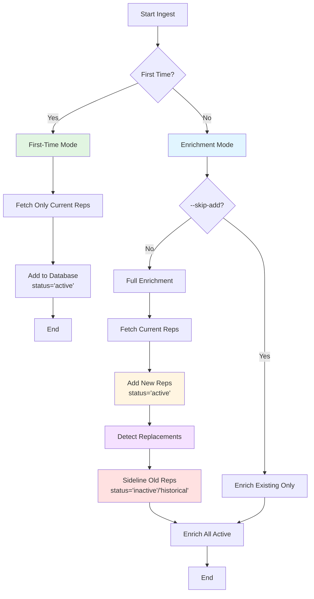

# Comprehensive Representative Change Tracking and Ingest Optimization Plan

## Overview

Implement a comprehensive system for ALL ingest clients (`/services/civics-backend/src/clients`) to:

1. **First-time run**: Only ingest current representatives
2. **Enrichment runs**: Add new representatives, sideline old ones with proper status tracking
3. Track representative changes (elections, replacements, retirements) with status flags and replacement relationships
4. Optimize OpenStates API usage (the only restrictive API) to respect rate limits

## Ingest Clients Analysis

### All Clients in `/services/civics-backend/src/clients`:

1. **congress.ts** - Congress.gov API (federal representatives) - **HAS ADD/DЕACTIVATE**
2. **openstates.ts** - OpenStates API (state bills/activity) - **RATE LIMITED, ENRICHMENT ONLY**
3. **fec.ts** - FEC API (campaign finance) - **ENRICHMENT ONLY**
4. **govinfo.ts** - GovInfo API (federal member details) - **ENRICHMENT ONLY**
5. **googleCivic.ts** - Google Civic API (elections, representatives by division) - **ENRICHMENT ONLY**
6. **supabase.ts** - Supabase client (database operations)

### Ingest Flow Pattern



## Current State Analysis - What Works Correctly

### Federal Enrich (congress.ts) - **GOOD PATTERN TO KEEP**

- ✅ `addNewFederalRepsFromCongress()` - Adds new current Congress members
- ✅ `deactivateFederalRepsNotInCongress()` - Deactivates old ones with deduplication
- ✅ `--skip-add` flag - Allows enrichment-only runs (skip add/deactivate)
- ✅ Only fetches current Congress (119th) - `CURRENT_CONGRESS = 119`
- ✅ Deduplication logic - One row per unique Congress member
- ✅ Batched updates (500 per batch) to avoid API limits
- ⚠️ Uses `is_active = false` (needs status tracking)

### OpenStates People (YAML) - **GOOD PATTERN TO KEEP**

- ✅ `sync_representatives_from_openstates()` - Updates/inserts current reps
- ✅ `deactivate_non_current_openstates_reps()` - Deactivates non-current
- ✅ Only processes current roles (`is_current = true`)
- ⚠️ Uses `is_active = false` (needs status tracking)

### OpenStates API (openstates.ts) - **NEEDS OPTIMIZATION**

- ⚠️ **Rate limited**: 6500ms throttle, ~10,000 requests/day
- ⚠️ Requires `openstatesPersonId` but API accepts alternatives
- ✅ Current: Uses `sponsor` parameter with person ID
- ⚠️ Could use `jurisdiction` + `q` (query) as fallback when ID unavailable

### Other Clients (FEC, GovInfo, Google Civic) - **ENRICHMENT ONLY**

- ✅ FEC: Only enriches existing reps (no add/deactivate)
- ✅ GovInfo: Only enriches existing reps (no add/deactivate)
- ✅ Google Civic: Only enriches existing reps (no add/deactivate)
- ✅ These work correctly - no changes needed

### Current Change Tracking - **NEEDS IMPROVEMENT**

- ⚠️ Uses `is_active` boolean flag only
- ⚠️ No distinction between retirement, replacement, term end, etc.
- ⚠️ No tracking of successor/replacement relationships
- ⚠️ No status reason or change timestamp

## Critical Optimizations (Before Wipe)

**See**: `services/civics-backend/docs/SCHEMA_OPTIMIZATIONS_FINAL.md` for comprehensive optimization recommendations.

### Must-Fix Before Wipe:

1. **Unique Constraints**: Add unique indexes on `openstates_id`, `bioguide_id` (federal), `canonical_id`
2. **Performance Indexes**: Add composite indexes for common query patterns (is_active + state + level, name search, data_quality_score)
3. **Foreign Keys**: Verify/add foreign keys on all child tables with appropriate ON DELETE behavior
4. **Check Constraints**: Add validation for state format, level enum, term dates, next_election_date
5. **NOT NULL Constraints**: Add on critical fields (name, level, state, office, status, timestamps)
6. **Updated_at Trigger**: Auto-update `updated_at` on all tables

### Should-Fix Before Wipe:

7. **Canonical ID Validation**: Add check constraint to ensure format consistency
8. **Status Tracking**: Add status enum, replaced_by_id, status_reason, status_changed_at (from main plan)

## Implementation Plan

### Phase 0: Schema Optimizations (CRITICAL - Do First)

**Goal**: Fix schema issues before adding status tracking.

#### 0.1 Run Deduplication

- Run `npm run tools:fix:duplicates -- --apply` to clean existing duplicates
- Verify no duplicates remain: `npm run tools:report:duplicates`

#### 0.2 Add Unique Constraints

**Migration**: `supabase/migrations/YYYYMMDD_add_unique_constraints_representatives_core.sql`

```sql
-- Unique on openstates_id (where not null)
CREATE UNIQUE INDEX CONCURRENTLY IF NOT EXISTS idx_representatives_core_openstates_id_unique
  ON representatives_core(openstates_id)
  WHERE openstates_id IS NOT NULL;

-- Unique on bioguide_id for federal (where not null)
CREATE UNIQUE INDEX CONCURRENTLY IF NOT EXISTS idx_representatives_core_bioguide_id_unique
  ON representatives_core(bioguide_id)
  WHERE bioguide_id IS NOT NULL AND level = 'federal';

-- Unique on canonical_id (where not null)
CREATE UNIQUE INDEX CONCURRENTLY IF NOT EXISTS idx_representatives_core_canonical_id_unique
  ON representatives_core(canonical_id)
  WHERE canonical_id IS NOT NULL;
```

#### 0.3 Add Performance Indexes

**Migration**: `supabase/migrations/YYYYMMDD_add_performance_indexes_representatives_core.sql`

```sql
-- Composite index for active rep queries
CREATE INDEX IF NOT EXISTS idx_representatives_core_active_state_level
  ON representatives_core(is_active, state, level)
  WHERE is_active = true;

-- Name search (trigram for ILIKE)
CREATE EXTENSION IF NOT EXISTS pg_trgm;
CREATE INDEX IF NOT EXISTS idx_representatives_core_name_trgm
  ON representatives_core USING gin(name gin_trgm_ops);

-- Data quality sorting
CREATE INDEX IF NOT EXISTS idx_representatives_core_data_quality_active
  ON representatives_core(data_quality_score DESC, name)
  WHERE is_active = true;

-- External ID lookups
CREATE INDEX IF NOT EXISTS idx_representatives_core_fec_id
  ON representatives_core(fec_id) WHERE fec_id IS NOT NULL;

CREATE INDEX IF NOT EXISTS idx_representatives_core_congress_gov_id
  ON representatives_core(congress_gov_id) WHERE congress_gov_id IS NOT NULL;
```

#### 0.4 Add Check Constraints

**Migration**: `supabase/migrations/YYYYMMDD_add_check_constraints_representatives_core.sql`

```sql
-- State format validation
ALTER TABLE representatives_core
  ADD CONSTRAINT chk_representatives_core_state_format
  CHECK (state IS NULL OR (LENGTH(state) = 2 AND state ~ '^[A-Z]{2}$'));

-- Level enum validation
ALTER TABLE representatives_core
  ADD CONSTRAINT chk_representatives_core_level
  CHECK (level IN ('federal', 'state', 'local'));

-- Term date validation
ALTER TABLE representatives_core
  ADD CONSTRAINT chk_representatives_core_term_dates
  CHECK (term_end_date IS NULL OR term_start_date IS NULL OR term_end_date >= term_start_date);

-- Next election validation
ALTER TABLE representatives_core
  ADD CONSTRAINT chk_representatives_core_next_election
  CHECK (next_election_date IS NULL OR next_election_date >= CURRENT_DATE);
```

#### 0.5 Add NOT NULL Constraints

**Migration**: `supabase/migrations/YYYYMMDD_add_not_null_constraints_representatives_core.sql`

```sql
-- Backfill NULLs first (if any exist)
UPDATE representatives_core SET name = 'Unknown' WHERE name IS NULL;
UPDATE representatives_core SET level = 'local' WHERE level IS NULL;
UPDATE representatives_core SET state = 'XX' WHERE state IS NULL;
UPDATE representatives_core SET office = 'Representative' WHERE office IS NULL;

-- Add NOT NULL constraints
ALTER TABLE representatives_core
  ALTER COLUMN name SET NOT NULL,
  ALTER COLUMN level SET NOT NULL,
  ALTER COLUMN state SET NOT NULL,
  ALTER COLUMN office SET NOT NULL,
  ALTER COLUMN created_at SET NOT NULL,
  ALTER COLUMN created_at SET DEFAULT now(),
  ALTER COLUMN updated_at SET NOT NULL,
  ALTER COLUMN updated_at SET DEFAULT now();
```

#### 0.6 Add Updated_at Trigger

**Migration**: `supabase/migrations/YYYYMMDD_add_updated_at_triggers.sql`

```sql
-- Create trigger function
CREATE OR REPLACE FUNCTION update_updated_at_column()
RETURNS TRIGGER AS $$
BEGIN
  NEW.updated_at = now();
  RETURN NEW;
END;
$$ LANGUAGE plpgsql;

-- Apply to representatives_core and all child tables
CREATE TRIGGER representatives_core_updated_at
  BEFORE UPDATE ON representatives_core
  FOR EACH ROW
  EXECUTE FUNCTION update_updated_at_column();

-- Repeat for: representative_contacts, representative_photos, 
-- representative_social_media, representative_activity, etc.
```

#### 0.7 Verify Foreign Keys

**Migration**: `supabase/migrations/YYYYMMDD_verify_foreign_keys.sql`

```sql
-- Verify all child tables have foreign keys
-- Add missing ones if needed
ALTER TABLE representative_contacts
  ADD CONSTRAINT fk_representative_contacts_representative_id
  FOREIGN KEY (representative_id)
  REFERENCES representatives_core(id)
  ON DELETE CASCADE;

-- Repeat for all child tables with appropriate ON DELETE behavior
```

### Phase 1: Database Schema Updates - Status Tracking

**Goal**: Add status tracking to all ingests, not just OpenStates.

#### 1.1 Add Status and Replacement Fields to `representatives_core`

**Migration**: `supabase/migrations/YYYYMMDD_add_representative_status_tracking.sql`

```sql
-- Add status enum
CREATE TYPE representative_status AS ENUM (
  'active',
  'inactive', 
  'historical'
);

-- Add status and replacement tracking columns
ALTER TABLE representatives_core
  ADD COLUMN IF NOT EXISTS status representative_status DEFAULT 'active',
  ADD COLUMN IF NOT EXISTS replaced_by_id INTEGER REFERENCES representatives_core(id),
  ADD COLUMN IF NOT EXISTS status_reason TEXT,
  ADD COLUMN IF NOT EXISTS status_changed_at TIMESTAMPTZ;

-- Create index for status filtering
CREATE INDEX IF NOT EXISTS idx_representatives_core_status 
  ON representatives_core(status) 
  WHERE status != 'active';

-- Create index for replacement lookups
CREATE INDEX IF NOT EXISTS idx_representatives_core_replaced_by 
  ON representatives_core(replaced_by_id) 
  WHERE replaced_by_id IS NOT NULL;

-- Migrate existing is_active to status
UPDATE representatives_core
SET status = CASE 
  WHEN is_active = true THEN 'active'::representative_status
  WHEN is_active = false THEN 'inactive'::representative_status
  ELSE 'historical'::representative_status
END,
status_changed_at = updated_at
WHERE status IS NULL;
```

**Files to modify**:

- Create new migration file
- Update `representatives_core` table schema documentation

#### 1.2 Update Sync Functions

**File**: `supabase/migrations/20251108023000_sync_representatives_function_v2.sql` (or new migration)

Update `sync_representatives_from_openstates()` to:

- Set `status = 'active'` for current reps
- Preserve `status` for existing rows when updating (don't overwrite historical status)
- Set `status_changed_at` when status changes

**File**: `supabase/migrations/20260127120000_deactivate_non_current_reps.sql`

Update `deactivate_non_current_openstates_reps()` to:

- Set `status = 'inactive'` instead of just `is_active = false`
- Set `status_reason = 'no_longer_current_in_openstates'`
- Set `status_changed_at = now()`

### Phase 2: First-Time vs Enrichment Run Pattern

**Goal**: Standardize pattern across ALL ingests for first-time (current only) vs enrichment (add new, sideline old).

#### 2.1 Create Unified Ingest Pattern

**New file**: `services/civics-backend/src/ingest/ingest-pattern.ts`

Create reusable functions:

```typescript
interface IngestOptions {
  firstTime?: boolean; // If true, only get current reps
  skipAdd?: boolean;   // If true, skip add/deactivate (enrichment only)
  dryRun?: boolean;
}

async function ingestCurrentRepresentatives(
  source: 'congress' | 'openstates' | 'google_civic',
  options: IngestOptions
): Promise<IngestResult>

async function enrichRepresentatives(
  source: 'congress' | 'openstates' | 'fec' | 'govinfo' | 'google_civic',
  options: IngestOptions
): Promise<EnrichmentResult>
```

#### 2.2 Update Federal Enrich (congress.ts)

**File**: `services/civics-backend/src/scripts/federal/enrich-congress-ids.ts`

**Keep existing pattern** (it works correctly):

- ✅ `addNewFederalRepsFromCongress()` - Add new current Congress members
- ✅ `deactivateFederalRepsNotInCongress()` - Sideline old ones
- ✅ `--skip-add` flag - Enrichment-only mode
- **Enhance with status tracking**:
  - Set `status = 'active'` for new/current reps
  - Set `status = 'inactive'`, `status_reason = 'no_longer_in_congress'` for deactivated
  - Detect replacements: If same district/state has different person, mark old as `status = 'historical'`, `status_reason = 'replaced'`, set `replaced_by_id`

#### 2.3 Update OpenStates People Merge

**File**: `services/civics-backend/src/scripts/openstates/run-openstates-merge.ts`

**Keep existing pattern** (it works correctly):

- ✅ `sync_representatives_from_openstates()` - Updates/inserts current
- ✅ `deactivate_non_current_openstates_reps()` - Sidelines non-current
- **Enhance with status tracking**:
  - Set `status = 'active'` for current reps
  - Set `status = 'inactive'`, `status_reason = 'no_longer_current_in_openstates'` for deactivated
  - Add replacement detection: Compare district/office, mark old as `historical` with `replaced_by_id`

#### 2.4 Create Replacement Detection Function

**New file**: `services/civics-backend/src/scripts/tools/detect-replacements.ts`

Logic to detect when a representative is replaced (works for both federal and state):

- Compare current source data with existing `representatives_core` rows
- For each district/office that had a rep but now has a different rep:
  - Mark old rep as `status = 'historical'`, `status_reason = 'replaced'`
  - Set `replaced_by_id` to new rep's ID
  - Set `status_changed_at = now()`

**Key detection scenarios**:

1. **Same district, different person**: Old rep replaced by new rep
2. **Term ended, new election**: Old rep's term ended, new rep elected
3. **Retirement**: Rep moved to `retired/` folder (OpenStates) or no longer in current Congress
4. **Death**: Rep has `death_date` in YAML (OpenStates)

**Usage**:

- Call after `addNewFederalRepsFromCongress()` and `deactivateFederalRepsNotInCongress()`
- Call after `sync_representatives_from_openstates()` and `deactivate_non_current_openstates_reps()`

### Phase 3: OpenStates API Optimization (Rate Limit Management)

**Goal**: Optimize the ONLY rate-limited API (OpenStates) to minimize calls and respect limits.

#### 3.1 Research and Optimize API Calls

**File**: `services/civics-backend/src/clients/openstates.ts`

**Current implementation analysis**:

- `fetchRecentBillsForPerson()` requires `openstatesPersonId` but API accepts alternatives
- Check if we can use `jurisdiction` + `q` (name query) when ID unavailable
- Verify API documentation for exact requirements

**Optimization strategies**:

1. **Batch requests**: Group by jurisdiction to reduce API calls
2. **Cache results**: Store bill data with TTL to avoid redundant calls
3. **Prioritize by jurisdiction**: Process high-priority states first
4. **Fallback to query**: If ID unavailable, use name + jurisdiction query

**Implementation**:

```typescript
// Enhanced fetch with fallback
export async function fetchRecentBillsForPerson(
  openstatesPersonId: string | null,
  options: FetchBillsOptions & { name?: string }
): Promise<OpenStatesBill[]> {
  // If ID available, use it (most efficient)
  if (openstatesPersonId) {
    return fetchWithSponsor(openstatesPersonId, options);
  }
  
  // Fallback: use jurisdiction + name query
  if (options.jurisdiction && options.name) {
    return fetchWithQuery(options.jurisdiction, options.name, options);
  }
  
  return [];
}
```

#### 3.2 Add Rate Limit Monitoring

**File**: `services/civics-backend/src/clients/openstates.ts`

Add rate limit tracking:

- Track daily request count
- Log warnings when approaching limits
- Add `--check-rate-limit` flag to scripts
- Implement exponential backoff on 429 errors

### Phase 4: Ensure First-Time Run Gets Only Current Representatives

**Goal**: All ingests should have a clear first-time mode that only gets current reps.

#### 4.1 Federal Ingest (congress.ts)

**Already correct**:

- ✅ Only fetches current Congress (119th) via `CURRENT_CONGRESS = 119`
- ✅ `addNewFederalRepsFromCongress()` only adds current members
- ✅ `deactivateFederalRepsNotInCongress()` sidelines non-current

**Enhancement**: Add `--first-time` flag that:

- Skips enrichment (profile updates)
- Only runs add/deactivate
- Sets all new reps to `status = 'active'`

#### 4.2 OpenStates People (YAML)

**Already correct**:

- ✅ Only processes current roles (`is_current = true`)
- ✅ `sync_representatives_from_openstates()` only syncs current
- ✅ `deactivate_non_current_openstates_reps()` sidelines non-current

**Enhancement**: Add `--first-time` flag that:

- Skips activity sync (`SKIP_ACTIVITY_SYNC=1`)
- Only runs stage + merge + deactivate
- Sets all new reps to `status = 'active'`

#### 4.3 Other Clients (FEC, GovInfo, Google Civic)

**Already correct**:

- ✅ These are enrichment-only (no add/deactivate)
- ✅ They work on existing reps only

**No changes needed** - these are enrichment-only by design.

### Phase 5: Update TypeScript Types

#### 4.1 Update Representative Types

**File**: `web/types/representative.ts`

Add new fields:

```typescript
export type Representative = {
  // ... existing fields
  status?: 'active' | 'inactive' | 'historical';
  replaced_by_id?: number;
  status_reason?: string;
  status_changed_at?: string;
  // Keep is_active for backward compatibility (computed from status)
  is_active: boolean; // computed: status === 'active'
}
```

**File**: `services/civics-backend/src/ingest/supabase/representatives.ts`

Update `SupabaseRepresentativeRow` interface to include new fields.

### Phase 6: Update Frontend Queries

#### 5.1 Update Service Queries

**File**: `web/lib/services/civics-integration.ts`

Update queries to:

- Filter by `status = 'active'` instead of just `is_active = true`
- Optionally include historical reps with `status = 'historical'` for user context
- Show replacement information when available

**File**: `web/app/api/v1/civics/representative/[id]/route.ts`

Include replacement information in representative detail responses:

```typescript
// Include replaced_by info
const replacedBy = rep.replaced_by_id 
  ? await getRepresentativeById(rep.replaced_by_id)
  : null;
```

### Phase 7: Documentation and Testing

#### 6.1 Update Documentation

**Files to update**:

- `services/civics-backend/docs/CIVICS_INGEST_FLOW_INVESTIGATION.md` - Document status tracking
- `services/civics-backend/docs/OPTIMIZED_INGEST_FLOWS.md` - Update with replacement detection
- Create `services/civics-backend/docs/REPRESENTATIVE_STATUS_TRACKING.md` - New guide

#### 6.2 Add Audit Scripts

**New file**: `services/civics-backend/src/scripts/tools/audit-status.ts`

Script to:

- Report status distribution (active/inactive/historical counts)
- Identify reps with missing replacement links
- Verify status consistency with `is_active` flag
- Check for orphaned `replaced_by_id` references

## Implementation Order

### Pre-Wipe (Critical Optimizations)

0. **Schema optimizations** (Phase 0) - **MUST DO BEFORE WIPE**

   - Run deduplication
   - Add unique constraints
   - Add performance indexes
   - Add check constraints
   - Add NOT NULL constraints
   - Add updated_at triggers
   - Verify foreign keys

### Post-Wipe (Status Tracking & Ingest Improvements)

1. **Status tracking schema** (Phase 1) - Add status enum, replaced_by_id, etc.
2. **First-time vs enrichment pattern** (Phase 2) - Standardize across all ingests
3. **Replacement detection** (Phase 2.4) - Core functionality for tracking changes
4. **OpenStates API optimization** (Phase 3) - Rate limit management
5. **First-time run verification** (Phase 4) - Ensure all ingests support first-time mode
6. **Type updates** (Phase 5) - Type safety
7. **Frontend updates** (Phase 6) - User-facing changes
8. **Documentation** (Phase 7) - Knowledge transfer

## Key Principles from Current System (Keep These)

### What Works Correctly - Preserve These Patterns

1. **Federal enrich pattern** (`addNewFederalRepsFromCongress` + `deactivateFederalRepsNotInCongress` + `--skip-add`)

   - ✅ Adds only current Congress members (119th)
   - ✅ Deactivates non-current with deduplication
   - ✅ `--skip-add` flag for enrichment-only runs
   - ✅ Batched updates (500 per batch) to avoid API limits
   - ✅ Deduplication: One row per unique Congress member

2. **OpenStates merge pattern** (`sync_representatives_from_openstates` + `deactivate_non_current_openstates_reps`)

   - ✅ Only processes current roles (`is_current = true`)
   - ✅ Updates existing, inserts new
   - ✅ Deactivates non-current after sync
   - ✅ `SKIP_ACTIVITY_SYNC=1` for staging-only runs

3. **Deduplication logic** (Federal script)

   - ✅ Groups by `congressMemberKey` (bioguide or memberId)
   - ✅ Keeps one row per unique current member
   - ✅ Prefers rows with bioguide, then lowest ID

4. **Batched updates** (Federal script)

   - ✅ Batches deactivations in chunks of 500
   - ✅ Avoids "Bad Request" errors with large ID lists

5. **Current-only filtering**

   - ✅ Federal: `CURRENT_CONGRESS = 119` in API path
   - ✅ OpenStates: `is_current = true` in view filter

6. **Enrichment-only mode**

   - ✅ `--skip-add` flag (federal)
   - ✅ `SKIP_ACTIVITY_SYNC=1` (OpenStates)
   - ✅ Allows updating existing without add/deactivate overhead

## What to Add/Enhance

1. **Status tracking** - Add `status` enum, `replaced_by_id`, `status_reason`, `status_changed_at` to all ingests
2. **Replacement detection** - Detect when same district/office gets new rep (for both federal and state)
3. **First-time flag** - Clear `--first-time` mode for initial ingest (current only, skip enrichment)
4. **OpenStates API fallback** - Use `jurisdiction` + `q` (query) when `openstatesPersonId` unavailable
5. **Rate limit monitoring** - Track and warn about OpenStates API usage (only rate-limited API)
6. **Standardize pattern** - Apply federal enrich pattern (addNew/deactivate) to other ingests that need it
7. **Preserve historical** - Keep old/replaced reps with `status='historical'` instead of deleting

## Testing Strategy

1. **Unit tests**: Replacement detection logic
2. **Integration tests**: Sync functions with status updates
3. **API tests**: Rate limit handling and fallback logic
4. **Data validation**: Verify status consistency after sync

## Migration Considerations

- **Backward compatibility**: Keep `is_active` field, compute from `status`
- **Data migration**: Existing `is_active=false` → `status='inactive'`
- **Gradual rollout**: Test with single state first, then expand

## Success Criteria

- ✅ **All ingests** support first-time mode (current reps only)
- ✅ **All ingests** support enrichment mode (add new, sideline old)
- ✅ Representatives properly flagged when replaced (status = 'historical', replaced_by_id set)
- ✅ Historical reps preserved with correct status (not deleted)
- ✅ Replacement relationships tracked via `replaced_by_id`
- ✅ OpenStates API usage optimized (fewer calls, better fallbacks)
- ✅ Rate limits respected (no 429 errors)
- ✅ Frontend can display replacement information
- ✅ Audit scripts verify data consistency
- ✅ Existing patterns preserved (addNew/deactivate, --skip-add, deduplication, batching)

## Ingest-Specific Requirements

### Federal (congress.ts)

- ✅ **First-time**: Only current Congress (119th) members via `CURRENT_CONGRESS = 119`
- ✅ **Enrichment**: Add new via `addNewFederalRepsFromCongress()`, sideline old via `deactivateFederalRepsNotInCongress()`
- ✅ **Enhancement**: Add status tracking, replacement detection
- ✅ **Keep**: `--skip-add` flag, deduplication, batched updates (500 per batch)

### OpenStates People (YAML)

- ✅ **First-time**: Only current roles (`is_current = true`) via `openstates_people_current_roles_v`
- ✅ **Enrichment**: Sync current via `sync_representatives_from_openstates()`, sideline non-current via `deactivate_non_current_openstates_reps()`
- ✅ **Enhancement**: Add status tracking, replacement detection
- ✅ **Keep**: Existing sync/deactivate pattern, `SKIP_ACTIVITY_SYNC=1` flag

### OpenStates API (openstates.ts) - **ONLY RATE-LIMITED API**

- ✅ **Optimize**: Use `jurisdiction` + `q` (query) fallback when `openstatesPersonId` unavailable
- ✅ **Monitor**: Track daily request count, warn when approaching limits
- ✅ **Throttle**: Keep 6500ms throttle (`OPENSTATES_THROTTLE_MS`), add exponential backoff on 429
- ✅ **Note**: This is enrichment-only (bills/activity), not add/deactivate

### FEC (fec.ts)

- ✅ **Enrichment-only**: Only enriches existing reps with finance data
- ✅ **No changes needed** - Works correctly

### GovInfo (govinfo.ts)

- ✅ **Enrichment-only**: Only enriches existing reps with GovInfo IDs
- ✅ **No changes needed** - Works correctly

### Google Civic (googleCivic.ts)

- ✅ **Enrichment-only**: Only enriches existing reps with contact/social data
- ✅ **Elections**: Separate sync for elections (no rep changes)
- ✅ **No changes needed** - Works correctly

## Summary: Changes Required Per Client

### Clients Requiring Add/Deactivate Logic (First-Time + Enrichment)

| Client | First-Time Mode | Enrichment Mode | Status Tracking | Replacement Detection |

|--------|----------------|-----------------|-----------------|----------------------|

| **congress.ts** | ✅ Already works (current Congress only) | ✅ Already works (addNew/deactivate) | ⚠️ Add status fields | ⚠️ Add detection |

| **OpenStates People (YAML)** | ✅ Already works (current roles only) | ✅ Already works (sync/deactivate) | ⚠️ Add status fields | ⚠️ Add detection |

### Clients Requiring Only Enrichment (No Add/Deactivate)

| Client | Current Behavior | Changes Needed |

|--------|-----------------|----------------|

| **openstates.ts** (API) | Enrichment-only (bills) | ⚠️ Optimize API calls, add fallback |

| **fec.ts** | Enrichment-only (finance) | ✅ None - works correctly |

| **govinfo.ts** | Enrichment-only (IDs) | ✅ None - works correctly |

| **googleCivic.ts** | Enrichment-only (contacts) | ✅ None - works correctly |

## Implementation Checklist

### Phase 0: Schema Optimizations (CRITICAL - Before Wipe)

- [ ] Run deduplication: `npm run tools:fix:duplicates -- --apply`
- [ ] Verify no duplicates: `npm run tools:report:duplicates`
- [ ] Create migration: Add unique constraints (openstates_id, bioguide_id, canonical_id)
- [ ] Create migration: Add performance indexes (active+state+level, name search, data_quality)
- [ ] Create migration: Add check constraints (state format, level enum, term dates)
- [ ] Create migration: Add NOT NULL constraints (name, level, state, office, timestamps)
- [ ] Create migration: Add updated_at triggers (all tables)
- [ ] Create migration: Verify/add foreign keys (all child tables)
- [ ] Test migrations on staging database first

### Phase 1: Database Schema - Status Tracking

- [ ] Create migration for `status`, `replaced_by_id`, `status_reason`, `status_changed_at`
- [ ] Add indexes for status and replacement lookups
- [ ] Migrate existing `is_active` to `status` enum

### Phase 2: Federal Ingest (congress.ts)

- [ ] Update `addNewFederalRepsFromCongress()` to set `status = 'active'`
- [ ] Update `deactivateFederalRepsNotInCongress()` to set `status = 'inactive'/'historical'`
- [ ] Add replacement detection after add/deactivate
- [ ] Add `--first-time` flag (skip enrichment, only add current)
- [ ] Keep existing: `--skip-add`, deduplication, batching

### Phase 3: OpenStates People (YAML)

- [ ] Update `sync_representatives_from_openstates()` to set `status = 'active'` for current
- [ ] Update `deactivate_non_current_openstates_reps()` to set `status = 'inactive'`
- [ ] Add replacement detection after sync/deactivate
- [ ] Add `--first-time` flag (skip activity sync, only stage+merge)
- [ ] Keep existing: `SKIP_ACTIVITY_SYNC=1`, current roles filter

### Phase 4: OpenStates API (openstates.ts)

- [ ] Add fallback to `jurisdiction` + `q` when `openstatesPersonId` unavailable
- [ ] Add rate limit tracking (daily count, warnings)
- [ ] Add exponential backoff on 429 errors
- [ ] Keep existing: 6500ms throttle, request queue

### Phase 5: Replacement Detection

- [ ] Create `detect-replacements.ts` script
- [ ] Detect same district/office, different person
- [ ] Set `status = 'historical'`, `replaced_by_id`, `status_reason = 'replaced'`
- [ ] Integrate into federal and OpenStates merge flows

### Phase 6: Types & Frontend

- [ ] Update TypeScript types with status fields
- [ ] Update frontend queries to use `status` instead of `is_active`
- [ ] Add replacement information to representative detail pages

### Phase 7: Documentation & Testing

- [ ] Document status tracking system
- [ ] Create audit script for status consistency
- [ ] Test first-time vs enrichment modes
- [ ] Test replacement detection accuracy