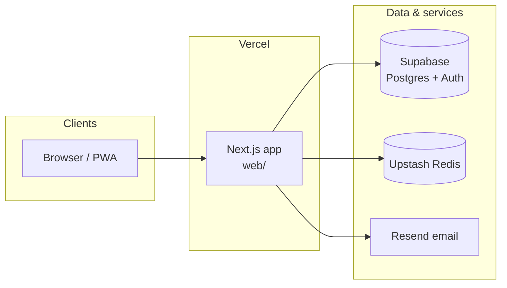

<p align="center">
  <a href="https://www.choices-app.com" title="Choices — production">
    
  </a>
</p>

<h1 align="center">Choices</h1>

<p align="center"><strong>Privacy-first participatory democracy platform</strong></p>

<p align="center">
  Polls, civic engagement, and representative data on open-source infrastructure.
</p>

<p align="center">
  <a href="https://www.choices-app.com"><strong>Live app</strong></a>
  &nbsp;·&nbsp;
  <a href="./docs/GETTING_STARTED.md"><strong>Get started</strong></a>
  &nbsp;·&nbsp;
  <a href="./docs/README.md"><strong>Documentation</strong></a>
  &nbsp;·&nbsp;
  <a href="./CONTRIBUTING.md"><strong>Contributing</strong></a>
  &nbsp;·&nbsp;
  <a href="./SECURITY.md"><strong>Security</strong></a>
  &nbsp;·&nbsp;
  <a href="./CODE_OF_CONDUCT.md"><strong>Code of conduct</strong></a>
</p>

<p align="center">
  <a href="https://github.com/choices-project/choices/actions/workflows/ci.yml"></a>
  <a href="./LICENSE"></a>
  <a href="./web/package.json"></a>
  <a href="./web/package.json"></a>
</p>

<p align="center">
  <sub>Repository: <a href="https://github.com/choices-project/choices">choices-project/choices</a> · Default branch: <code>main</code></sub>
</p>

---

## At a glance

| | |
|---|---|
| **What it is** | A **Next.js 14** (App Router) web app backed by **Supabase** (PostgreSQL, RLS, Auth), deployed on **Vercel**, with **Jest**, **Playwright**, and **axe-core** in CI. |
| **Who it is for** | Citizens and organizers using polls, feeds, and civic data—with **strong privacy defaults** and **equal-weight** poll tabulation where the product promises it. |
| **Where the code lives** | Application source under **[`web/`](./web/)** · cross-cutting docs under **[`docs/`](./docs/)** · database migrations under **[`supabase/`](./supabase/)**. |
| **How to run it locally** | Clone → `cd choices/web` → `npm install` → copy **`web/.env.local.example`** to **`.env.local`** → **`npm run dev`** → [http://localhost:3000](http://localhost:3000). Details: **[`docs/GETTING_STARTED.md`](./docs/GETTING_STARTED.md)**. |

---

## Overview

Choices supports civic participation: **polls** (multiple voting methods), **representative and civic datasets**, **personalized feeds**, and **privacy controls** aligned with how the product describes collection and visibility.

**Privacy and fairness.** We do not sell personal or row-level data. Optional programs (such as aggregate research panels) are **opt-in**, use coarsened or aggregated outputs where applicable, and can be revoked in settings. Surfaces that promise equal participation use **equal tabulation** (one person, one counted vote in the tallies users see). **Trust tiers** are optional verification and abuse-resistance signals—not a way to buy extra vote weight in those polls. See **[`docs/TRUST_LAYER.md`](./docs/TRUST_LAYER.md)**.

**Production.** **[https://www.choices-app.com](https://www.choices-app.com)** · Release and hosting notes: **[`docs/DEPLOYMENT.md`](./docs/DEPLOYMENT.md)**.

---

## Architecture (simplified)



---

## Repository layout

| Path | Purpose |
|------|--------|
| [`web/`](./web/) | **Main application** — Next.js 14 (App Router), React, API routes, features, tests |
| [`docs/`](./docs/) | Documentation (setup, architecture, security, inventories) |
| [`supabase/`](./supabase/) | Database migrations and Supabase-oriented assets |
| [`services/`](./services/) | Supporting backends and tooling (for example civics ingest) |
| [`scripts/`](./scripts/) | Repo-root automation (`verify:docs`, inventories, governance) |
| [`.github/`](./.github/) | CI workflows, issue/PR templates, security automation |

Most day-to-day commands run from **`web/`**. Doc parity and cross-cutting checks run from the **repository root**.

---

## Requirements

| Tool | Notes |
|------|--------|
| **Node.js** | **24.11.x** recommended (**Volta** pins in `web/package.json` and root `package.json`). `engines` allow **22.x–24.x** — see [`docs/GETTING_STARTED.md`](./docs/GETTING_STARTED.md). |
| **npm** | **11.6.x** (`packageManager` in `web/package.json`; CI matches). |
| **Supabase** | Full behavior needs a project and env vars. Placeholder env supports local UI and mocked E2E — see [`AGENTS.md`](./AGENTS.md). |
| **Playwright** | From `web/`: `npx playwright install --with-deps chromium` — [`docs/TESTING.md`](./docs/TESTING.md). |

---

## Quick start

```bash
git clone https://github.com/choices-project/choices.git
cd choices/web
npm install
cp .env.local.example .env.local   # edit values — see docs/GETTING_STARTED.md
npm run dev                        # http://localhost:3000
```

---

## Development

Run from **`web/`** unless noted.

| Command | Purpose |
|---------|--------|
| `npm run dev` | Dev server (port 3000, `TZ=UTC`) |
| `npm run lint` | ESLint |
| `npm run types:ci` | TypeScript (CI config — see [`AGENTS.md`](./AGENTS.md)) |
| `npm run test` | Jest |
| `npm run test:e2e` | Playwright (harness + mocks by default) |
| `npm run build` | Production build |

**Repository root** — after API route / schema / store-doc changes:

```bash
npm run verify:docs
```

Bundles link checks, store cascade verification, architecture boundaries, and related audits ([`docs/README.md`](./docs/README.md)). Requires **`ripgrep` (`rg`)**.

---

## Capabilities (product)

Shipped or actively integrated in **`web/`**; edge cases live in `docs/` and server contracts.

- **Polling** — Multiple voting methods (e.g. single, multiple, ranked, approval, quadratic, range) with results tied to server rules.
- **Civic engagement** — Representative discovery, petitions, and civic workflows where exposed; public-source data integrations (see civics and API docs).
- **Feeds** — Personalized content, district context, hashtag subscriptions where enabled.
- **Analytics home** — Configurable dashboard widgets and layout presets.
- **Authentication** — Supabase Auth; optional **WebAuthn / passkeys**; social providers when configured.
- **Trust and privacy** — Optional trust tiers (**T0–T3** model in [`docs/TRUST_LAYER.md`](./docs/TRUST_LAYER.md)); granular **opt-in** privacy settings; profile export; admin paths for sensitive flows.
- **Platform** — **PWA**-oriented behavior; push where supported; **i18n** (English / Spanish, CI-validated per [`CONTRIBUTING.md`](./CONTRIBUTING.md)); candidate verification and contact workflows with admin review where deployed.

---

## Tech stack

| Layer | Technology |
|-------|------------|
| App | **Next.js 14** (App Router), **React**, **TypeScript** (strict) |
| UI | **Tailwind CSS**, **shadcn/ui**, **Framer Motion** |
| Data & auth | **Supabase** (PostgreSQL, RLS, Auth); types in `web/types/` |
| State | **Zustand** + **Immer** (~21 store modules; logout cascade — [`docs/ARCHITECTURE.md`](./docs/ARCHITECTURE.md), [`docs/STATE_MANAGEMENT.md`](./docs/STATE_MANAGEMENT.md)) |
| Limits | **Upstash Redis** |
| Email | **Resend** |
| Hosting | **Vercel** ([`docs/DEPLOYMENT.md`](./docs/DEPLOYMENT.md)) |
| Testing | **Jest**, **Playwright**, **axe-core** |

After migrations: regenerate `web/types/supabase.ts` as needed, then **`npm run verify:docs`** from the repo root.

---

## Documentation

| Topic | Link |
|-------|------|
| Setup | [`docs/GETTING_STARTED.md`](./docs/GETTING_STARTED.md) |
| Environment | [`docs/ENVIRONMENT_VARIABLES.md`](./docs/ENVIRONMENT_VARIABLES.md) |
| Architecture | [`docs/ARCHITECTURE.md`](./docs/ARCHITECTURE.md) |
| State | [`docs/STATE_MANAGEMENT.md`](./docs/STATE_MANAGEMENT.md) |
| Testing | [`docs/TESTING.md`](./docs/TESTING.md) |
| Deployment | [`docs/DEPLOYMENT.md`](./docs/DEPLOYMENT.md) |
| Security | [`docs/SECURITY.md`](./docs/SECURITY.md) · **[`SECURITY.md`](./SECURITY.md)** (reporting) |
| Privacy (source) | [`docs/PRIVACY_POLICY.md`](./docs/PRIVACY_POLICY.md) |
| Trust layer | [`docs/TRUST_LAYER.md`](./docs/TRUST_LAYER.md) |
| Feedback vs Issues | [`docs/FEEDBACK_AND_ISSUES.md`](./docs/FEEDBACK_AND_ISSUES.md) |
| Agents / tooling | [`docs/AGENT_SETUP.md`](./docs/AGENT_SETUP.md) · [`AGENTS.md`](./AGENTS.md) |
| **Full index** | [`docs/README.md`](./docs/README.md) |

**Norms:** [`CONTRIBUTING.md`](./CONTRIBUTING.md) · [`CODE_OF_CONDUCT.md`](./CODE_OF_CONDUCT.md) · [`docs/COMMUNITY_GUIDELINES.md`](./docs/COMMUNITY_GUIDELINES.md)

---

## Contributing

Use **GitHub Issues** for work that closes with **`Closes #…`**; use the **in-app feedback widget** on production for user-facing product feedback when appropriate ([`docs/FEEDBACK_AND_ISSUES.md`](./docs/FEEDBACK_AND_ISSUES.md)).

```bash
cd web
npm run lint && npm run types:ci && npm run test
cd .. && npm run verify:docs    # when docs, routes, schema, or store inventories change
git commit -s -m "feat: your change"   # DCO — see CONTRIBUTING.md
```

**Principles:** privacy first, equal voting where promised, open source, accessibility, performance.

---

## License

**[MIT License](./LICENSE)**. Inbound contributions use the **Developer Certificate of Origin (DCO)** — [`CONTRIBUTING.md`](./CONTRIBUTING.md).

**Security:** do not use public issues for vulnerabilities — **[`SECURITY.md`](./SECURITY.md)**.
