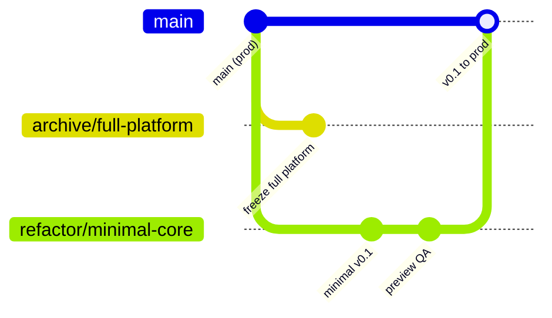

# Minimal Core (v0.1)

_Last updated: June 24, 2026_

**Contributors: start here** on branch `refactor/minimal-core`. Production deploys from `main` until v0.1 is merged; use a **Vercel preview** on this branch to validate before merge.

## Branch policy

| Branch / ref | Purpose |
|--------------|---------|
| `main` | Production (https://www.choices-app.com) — **unchanged** until v0.1 merge |
| `archive/full-platform` | Frozen snapshot of full platform **before** minimal-core lands on `main` |
| `refactor/minimal-core` | v0.1 rebuild — slim nav, auth, polls, profile |

### Git workflow (slim-branch strategy)

1. **Preserve production code** — Before merging minimal core into `main`, create `archive/full-platform` from the current `main` tip (and optionally tag `archive/full-platform-YYYY-MM-DD`). That branch is the reference for restoring feeds, civics, admin, etc.
2. **Develop on `refactor/minimal-core`** — All v0.1 work stays here until manual QA + CI pass.
3. **Preview deploy** — Push `refactor/minimal-core` to GitHub; Vercel builds a **preview URL** (not production). Test auth, polls, landing on that URL.
4. **Merge when ready** — Open PR `refactor/minimal-core` → `main`. After merge, production deploys the minimal app; features return incrementally via issues labeled `minimal-core`.
5. **Incremental restore** — Copy routes from `web/_archive/2026-minimal/` or `archive/full-platform` back into `web/app/` one feature at a time; do not merge the archive branch wholesale.

## Deploy to Vercel (preview)

Do **not** merge to `main` until you have validated the preview.

1. Push the branch: `git push -u origin refactor/minimal-core`
2. Open the Vercel deployment for that branch (GitHub PR checks or Vercel dashboard → Deployments).
3. Use the preview URL for the manual checklist below (same Supabase project as production unless you configure a staging project).
4. After merge to `main`, production updates via the existing CI/CD path (`push` → validation → manual production deploy workflow if configured).

**Session / cache on preview:** If `/` shows polls instead of landing, visit `/clear-session` on the preview host once (clears httpOnly cookies + service worker caches).

## v0.1 in scope

| Area | Routes / behavior |
|------|-------------------|
| Landing | `/` |
| Legal | `/terms`, `/privacy` |
| Auth | `/auth` — email/password + register only |
| Polls | `/polls`, `/polls/[id]`, `/polls/[id]/results` — list, view, vote, results |
| Poll create | `/polls/create` — single-choice one-page form |
| Profile | `/profile`, `/profile/edit` — display name, basic fields |

**Navigation:** Polls (home), Create, Profile, Sign in/out, theme toggle.

## Out of scope (archived; return via tracked issues)

Feeds, dashboard, civics, contact, admin, analytics, onboarding wizard, passkeys, OAuth UI, device flow, PWA offline, command palette, hashtags, moderation UI, candidate journey, E2E harness pages under `app/(app)/e2e/`.

## Architecture rules

1. **One auth read in UI** — `useAuth()` / `AuthContext` only (no merging context + multiple stores in nav).
2. **No new Zustand stores** — at most `userStore`, `pollsStore`, `votingStore`, `notificationStore`.
3. **Server-first poll detail** — SSR in `features/polls/pages/[id]/page.tsx`.
4. **Email/password auth only** in UI for v0.1.
5. **Single-choice poll create** — `CreatePollForm`, not the multi-step wizard.

## Definition of done

### Manual checklist

- [ ] `/` landing loads without console errors
- [ ] Register → login → lands on `/polls`
- [ ] Refresh keeps session on `/polls`
- [ ] Logout clears session
- [ ] Poll list loads
- [ ] Open poll → vote → results update
- [ ] Create single-choice poll → appears in list
- [ ] Edit display name on profile
- [ ] Nav works across all v0.1 routes

### Automated

- [ ] `cd web && npm run types:ci`
- [ ] `cd web && npm run lint`
- [ ] `cd web && npm run test:e2e:smoke` (`minimal-core-smoke.spec.ts`, `@smoke`)
- [ ] `npm run verify:docs` (from repo root, after API inventory updates)

## Failure log (baseline)

Track regressions in GitHub issues labeled `minimal-core`. Initial Tier 2 routes to verify:

| Route | Nav OK | Renders | Notes |
|-------|--------|---------|-------|
| `/` | — | | |
| `/auth` | — | | |
| `/polls` | | | |
| `/polls/create` | | | |
| `/profile` | | | |
| `/terms` | | | |
| `/privacy` | | | |

## Related docs

- [GETTING_STARTED.md](./GETTING_STARTED.md) — local setup
- [CONTRIBUTING.md](../CONTRIBUTING.md) — contribution workflow
- [web/lib/auth/README.md](../web/lib/auth/README.md) — auth architecture
