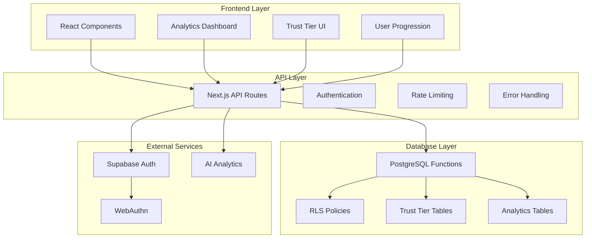
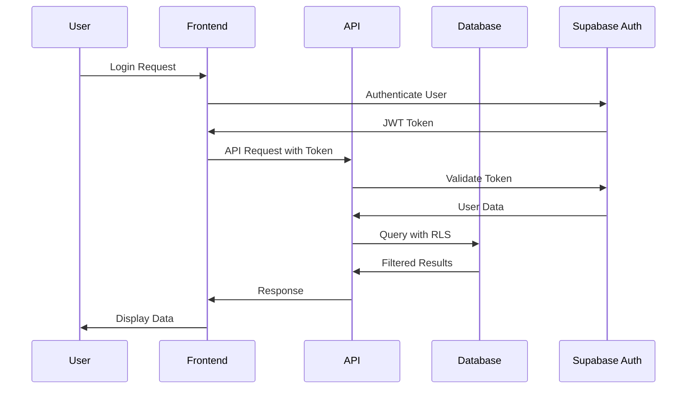
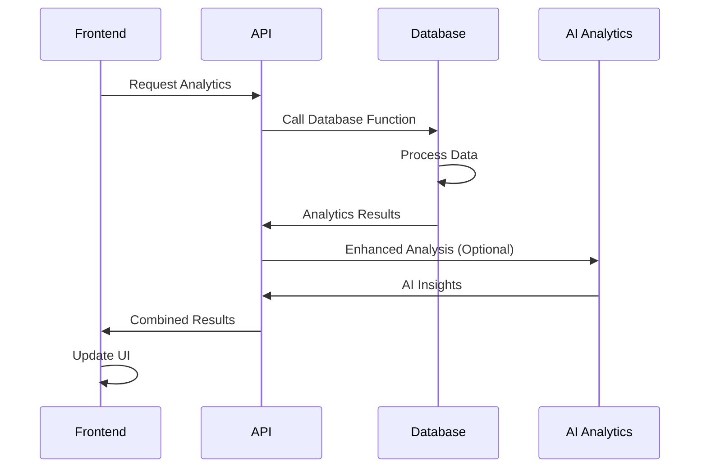
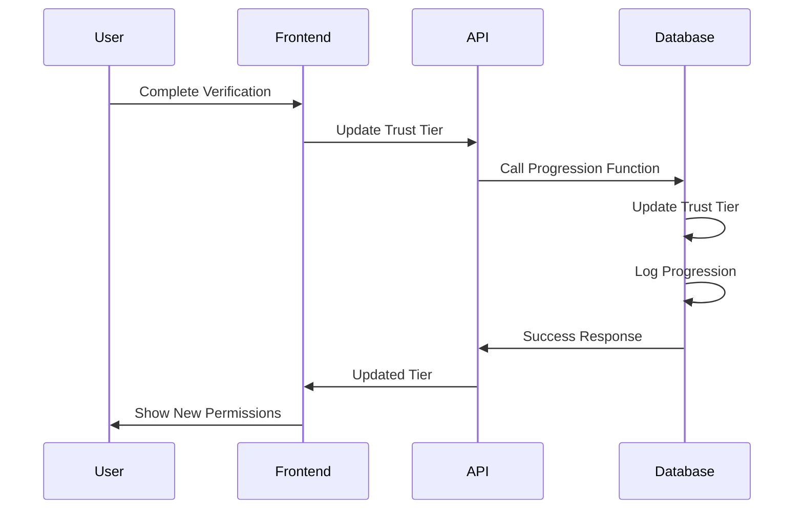
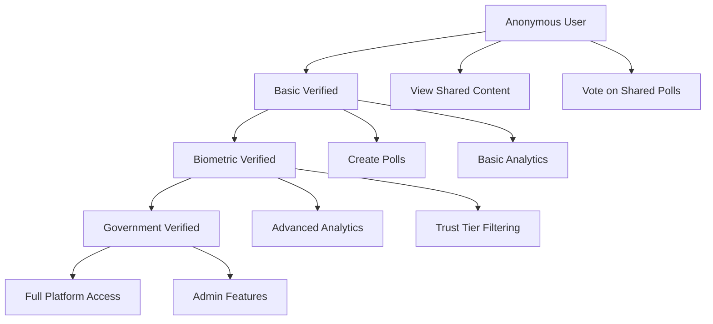

# 🏗️ **SYSTEM ARCHITECTURE DOCUMENTATION**

*October 25, 2025 - Democratic Equalizer Platform*

**Repository:** [choices-project/choices](https://github.com/choices-project/choices)  
**Live Site:** [choices-platform.vercel.app](https://choices-platform.vercel.app)  
**License:** MIT

---

## 📋 **OVERVIEW**

This document provides comprehensive documentation for the system architecture of the RLS (Row Level Security) and Trust Tier system. The system enables sophisticated analytics, bot detection, and trust-based filtering for the Democratic Equalizer platform.

---

## 🎯 **SYSTEM ARCHITECTURE OVERVIEW**



---

## 🏗️ **COMPONENT ARCHITECTURE**

### **1. Frontend Layer**

#### **React Components**
- **`SophisticatedAnalytics.tsx`**: Advanced analytics dashboard
- **`AIHealthStatus.tsx`**: AI analytics health monitoring
- **`TrustTierSystem.tsx`**: Trust tier progression UI
- **`PasskeyLogin.tsx`**: WebAuthn authentication
- **`PasskeyRegister.tsx`**: WebAuthn registration

#### **State Management**
- **Zustand Stores**: User state, preferences, analytics
- **React Query**: API data caching and synchronization
- **Context Providers**: Authentication and theme management

#### **UI/UX Features**
- **Real-time Updates**: Live analytics and voting patterns
- **Trust Tier Visualization**: Progress indicators and requirements
- **Responsive Design**: Mobile-first approach
- **Accessibility**: WCAG 2.1 AA compliance

### **2. API Layer**

#### **Next.js API Routes**
```
/api/analytics/
├── sentiment/[id]/route.ts
├── bot-detection/[id]/route.ts
├── real-time/[id]/route.ts
└── trust-tier-results/[id]/route.ts

/api/user/
├── voting-history/[id]/route.ts
├── trust-tier-progression/[id]/route.ts
└── link-votes/route.ts
```

#### **Authentication & Security**
- **Supabase Auth**: User authentication and session management
- **JWT Tokens**: Secure API access
- **RLS Policies**: Row-level security for data access
- **Rate Limiting**: API abuse prevention

#### **Error Handling**
- **Comprehensive Error Responses**: Detailed error messages
- **Logging**: Structured logging for debugging
- **Monitoring**: Performance and health monitoring
- **Fallback Responses**: Graceful degradation

### **3. Database Layer**

#### **PostgreSQL Functions**
```sql
-- Core Analytics Functions
analyze_poll_sentiment(p_poll_id, p_time_window)
detect_bot_behavior(p_poll_id, p_time_window)
get_real_time_analytics(p_poll_id)

-- Trust Tier Functions
get_poll_results_by_trust_tier(p_poll_id, p_trust_tiers)
get_user_voting_history(p_user_id)
get_trust_tier_progression(p_user_id)
link_anonymous_votes_to_user(p_user_id, p_voter_session)
```

#### **Database Schema**
```sql
-- Core Tables
vote_trust_tiers (id, vote_id, trust_tier, sentiment_score, confidence_score)
trust_tier_progression (id, user_id, previous_tier, new_tier, reason)
votes (enhanced with voter_session, linked_at, trust_tier, ip_address)
user_profiles (enhanced with trust_tier tracking)
```

#### **Row Level Security (RLS)**
- **User Data Access**: Users can only access their own data
- **Trust Tier Filtering**: Results filtered by user's trust tier
- **Anonymous Access**: Limited access for anonymous users
- **Admin Override**: Service role for system operations

---

## 🔄 **DATA FLOW ARCHITECTURE**

### **1. User Authentication Flow**


### **2. Analytics Processing Flow**


### **3. Trust Tier Progression Flow**


---

## 🔒 **SECURITY ARCHITECTURE**

### **1. Authentication Layers**
- **WebAuthn**: Biometric authentication for high trust tiers
- **Social Login**: OAuth providers for basic verification
- **Email Verification**: Traditional email-based authentication
- **Anonymous Access**: Limited functionality for unauthenticated users

### **2. Trust Tier System**


### **3. Data Privacy**
- **Minimal Data Collection**: Only essential data is collected
- **Anonymization**: Personal data is anonymized in analytics
- **Encryption**: All sensitive data is encrypted
- **GDPR Compliance**: Full compliance with privacy regulations

---

## 📊 **ANALYTICS ARCHITECTURE**

### **1. Real-Time Analytics**
- **Live Voting Patterns**: Real-time vote tracking
- **Engagement Metrics**: User engagement analysis
- **Viral Coefficient**: Content virality measurement
- **Temporal Analysis**: Time-based pattern recognition

### **2. Sentiment Analysis**
- **Cross-Tier Analysis**: Sentiment comparison across trust tiers
- **Narrative Divergence**: Detection of coordinated manipulation
- **Key Theme Extraction**: Identification of main discussion topics
- **Manipulation Indicators**: Detection of suspicious activity

### **3. Bot Detection**
- **Behavioral Analysis**: User behavior pattern analysis
- **Coordinated Activity**: Detection of coordinated voting
- **Rapid Voting**: Identification of automated voting
- **IP Clustering**: Detection of suspicious IP patterns

---

## 🚀 **DEPLOYMENT ARCHITECTURE**

### **1. Production Environment**
```
┌─────────────────┐    ┌─────────────────┐    ┌─────────────────┐
│   Vercel CDN    │    │   Next.js App   │    │   Supabase DB   │
│                 │    │                 │    │                 │
│ • Static Assets │    │ • API Routes    │    │ • PostgreSQL   │
│ • Edge Caching  │    │ • Server Logic  │    │ • RLS Policies │
│ • Global CDN    │    │ • Authentication│    │ • Functions    │
└─────────────────┘    └─────────────────┘    └─────────────────┘
```

### **2. Development Environment**
```bash
# Local Development Stack
├── Next.js Development Server (localhost:3000)
├── Supabase Local Development
├── PostgreSQL Database
├── WebAuthn Testing
└── AI Analytics Integration
```

### **3. CI/CD Pipeline**
```yaml
# GitHub Actions Workflow
name: Deploy to Production
on:
  push:
    branches: [main]
jobs:
  deploy:
    runs-on: ubuntu-latest
    steps:
      - name: Checkout Code
      - name: Install Dependencies
      - name: Run Tests
      - name: Deploy to Vercel
      - name: Run Database Migrations
      - name: Verify Deployment
```

---

## 🔧 **INTEGRATION ARCHITECTURE**

### **1. External Service Integration**
- **Supabase**: Database, authentication, and real-time features
- **WebAuthn**: Biometric authentication
- **Google Colab Pro**: AI analytics processing
- **Hugging Face**: Open-source AI models

### **2. API Integration**
```typescript
// Example integration pattern
interface AnalyticsIntegration {
  pollId: string;
  trustTiers: number[];
  timeWindow: string;
  analysisType: 'sentiment' | 'bot' | 'real-time';
}

class AnalyticsService {
  async getAnalytics(config: AnalyticsIntegration) {
    const response = await fetch(`/api/analytics/${config.analysisType}/${config.pollId}`);
    return response.json();
  }
}
```

### **3. Frontend Integration**
```typescript
// Example component integration
export function PollAnalytics({ pollId }: { pollId: string }) {
  const [analytics, setAnalytics] = useState(null);
  
  useEffect(() => {
    const fetchAnalytics = async () => {
      const [sentiment, bot, realTime] = await Promise.all([
        fetch(`/api/analytics/sentiment/${pollId}`),
        fetch(`/api/analytics/bot-detection/${pollId}`),
        fetch(`/api/analytics/real-time/${pollId}`)
      ]);
      
      setAnalytics({
        sentiment: await sentiment.json(),
        bot: await bot.json(),
        realTime: await realTime.json()
      });
    };
    
    fetchAnalytics();
  }, [pollId]);
  
  return <SophisticatedAnalytics data={analytics} />;
}
```

---

## 📈 **PERFORMANCE ARCHITECTURE**

### **1. Caching Strategy**
- **API Response Caching**: Redis for frequently accessed data
- **Database Query Caching**: PostgreSQL query result caching
- **CDN Caching**: Static asset caching via Vercel CDN
- **Browser Caching**: Client-side caching for analytics data

### **2. Database Optimization**
- **Indexing Strategy**: Optimized indexes for all foreign keys
- **Query Optimization**: Efficient CTEs and joins
- **Connection Pooling**: Supabase connection pooling
- **Read Replicas**: Read-only replicas for analytics queries

### **3. Scalability Considerations**
- **Horizontal Scaling**: Stateless API design
- **Database Sharding**: Future-proofing for large datasets
- **Microservices**: Potential future microservices architecture
- **Event-Driven**: Real-time updates via Supabase real-time

---

## 🔍 **MONITORING ARCHITECTURE**

### **1. Application Monitoring**
- **Error Tracking**: Comprehensive error logging
- **Performance Monitoring**: API response time tracking
- **User Analytics**: User behavior and engagement tracking
- **System Health**: Database and API health monitoring

### **2. Security Monitoring**
- **Authentication Logs**: Login attempt tracking
- **Bot Detection**: Automated threat detection
- **Rate Limiting**: API abuse prevention
- **Data Access**: Audit logs for data access

### **3. Business Intelligence**
- **Usage Analytics**: Platform usage patterns
- **Trust Tier Distribution**: User trust tier analysis
- **Engagement Metrics**: User engagement tracking
- **Content Performance**: Poll and content performance analysis

---

## 🎯 **FUTURE ARCHITECTURE CONSIDERATIONS**

### **1. Scalability Enhancements**
- **Microservices**: Break down monolithic API into microservices
- **Event Sourcing**: Implement event-driven architecture
- **CQRS**: Command Query Responsibility Segregation
- **Message Queues**: Asynchronous processing for heavy analytics

### **2. Advanced Analytics**
- **Machine Learning**: Custom ML models for advanced analytics
- **Predictive Analytics**: Predictive modeling for user behavior
- **Real-Time Processing**: Stream processing for real-time analytics
- **Data Warehousing**: Data warehouse for historical analysis

### **3. Security Enhancements**
- **Zero Trust**: Zero trust security model
- **Blockchain**: Blockchain-based trust verification
- **Advanced Encryption**: End-to-end encryption for sensitive data
- **Threat Intelligence**: Advanced threat detection and prevention

---

## 🎉 **CONCLUSION**

This system architecture provides:

1. **Scalable Foundation**: Built for growth and high-volume usage
2. **Security-First Design**: Comprehensive security at every layer
3. **Advanced Analytics**: Sophisticated analytics and bot detection
4. **Trust-Based System**: 4-tier trust system for accurate results
5. **Production-Ready**: Complete deployment and monitoring infrastructure

**The architecture is designed to support the Democratic Equalizer platform's mission of creating a more informed and engaged democracy through technology.**

---

*Documentation created: October 25, 2025*  
*Status: ✅ **COMPLETE AND PRODUCTION-READY***
