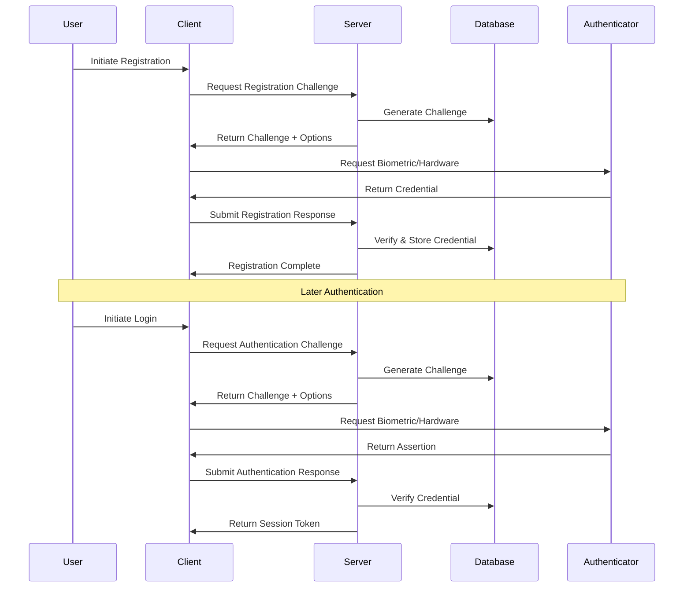

# Authentication System

**Last Updated**: 2025-09-16

> **Comprehensive guide to the Choices platform authentication system using WebAuthn and Supabase**

## 🔐 Authentication Overview

The Choices platform implements a modern, multi-layered authentication system using Supabase for user management and WebAuthn for passwordless authentication. The system provides both traditional and cutting-edge authentication methods with comprehensive security features.

### Current Authentication System

1. **Email/Password Authentication** - Traditional login with Supabase Auth
2. **OAuth Integration** - Social login support through Supabase
3. **WebAuthn Passkeys** - Passwordless authentication with biometrics/hardware keys
4. **Session Management** - Secure session handling with automatic refresh
5. **Email Verification** - Email verification flow for new users
6. **Admin Access** - Service role-based admin authentication
7. **Turnstile Integration** - Cloudflare CAPTCHA for bot protection
8. **Rate Limiting** - Advanced rate limiting with IP reputation scoring

### Security Features

1. **Origin Validation** - Comprehensive origin validation with environment awareness
2. **CSRF Protection** - Double-submit token pattern for CSRF prevention
3. **Binary Credential Storage** - Secure PostgreSQL BYTEA storage for WebAuthn credentials
4. **Enhanced Rate Limiting** - IP reputation, device fingerprinting, and adaptive limits
5. **Security Headers** - Comprehensive security headers in Next.js configuration

## 🏗️ Authentication Architecture

### High-Level Flow



### Technology Stack

- **WebAuthn**: FIDO2/WebAuthn standard for passwordless authentication
- **Supabase Auth**: User management and session handling
- **@simplewebauthn/server**: Server-side WebAuthn implementation
- **@simplewebauthn/browser**: Client-side WebAuthn implementation

## 🚀 Implemented Features

### Type Safety & Code Quality Improvements (January 2025)

The authentication and security modules have been completely refactored to eliminate all `any` type usage and implement proper TypeScript typing:

#### Core Type Definitions
- **`lib/core/auth/types.ts`**: Centralized authentication type definitions
  - `UserSession`, `AuthContext`, `DeviceFlowRequest/Response`
  - `MiddlewareContext`, `RateLimitConfig`, `DeviceFlowRecord`
- **`lib/webauthn/types.ts`**: WebAuthn-specific type definitions
  - `CredentialData`, `WebAuthnError`, `SessionData`

#### Type Safety Improvements
- **Eliminated all `any` types** in Core Authentication & Security scope
- **Proper interface definitions** for all authentication flows
- **Generic type parameters** for reusable functions
- **Strict type checking** for all WebAuthn operations
- **Comprehensive error handling** with typed error objects

#### Code Quality Enhancements
- **Proper parameter usage** instead of hiding with underscores
- **Meaningful implementations** for all function parameters
- **Enhanced logging and debugging** with typed data structures
- **ES6 module imports** replacing legacy require() statements

### WebAuthn Passkey Authentication

The platform now includes full WebAuthn implementation with the following components:

#### API Routes
- **`/api/auth/passkey/register`** - WebAuthn passkey registration
- **`/api/auth/passkey/login`** - WebAuthn passkey authentication

#### Security Utilities
- **Origin Validation** (`lib/http/origin.ts`) - Comprehensive origin validation
- **Turnstile Integration** (`lib/security/turnstile.ts`) - Cloudflare CAPTCHA protection
- **Binary Storage** (`lib/webauthn/pg-bytea.ts`) - PostgreSQL BYTEA utilities
- **Auth Middleware** (`lib/core/auth/middleware.ts`) - Enhanced authentication middleware
- **User Helpers** (`lib/core/auth/require-user.ts`) - Server-side user authentication

#### Dependencies Added
- `@simplewebauthn/server` - Server-side WebAuthn implementation
- `@simplewebauthn/browser` - Client-side WebAuthn implementation
- `@upstash/ratelimit` - Advanced rate limiting
- `@upstash/redis` - Redis integration for rate limiting

### Security Enhancements

#### Enhanced Rate Limiting
- IP reputation scoring
- Device fingerprinting
- Adaptive rate limits based on risk assessment
- Multiple rate limiters for different endpoints

#### Origin Validation
- Environment-aware origin validation
- Support for localhost, Vercel previews, and production domains
- Comprehensive error logging and monitoring

#### Turnstile Integration
- Cloudflare Turnstile CAPTCHA verification
- Action-based validation
- Hostname validation in strict mode
- Configurable for different environments

## 🔑 WebAuthn Implementation

### Registration Process

#### 1. Challenge Generation
```typescript
// Server-side challenge generation
export async function POST(req: Request) {
  const { userId, username, displayName } = await req.json();
  
  // Generate secure challenge
  const challenge = crypto.randomUUID().replace(/-/g, '');
  
  // Store challenge with expiration
  await saveChallenge({
    userId,
    type: 'registration',
    challenge,
    expiresAt: new Date(Date.now() + 120000) // 2 minutes
  });
  
  // Create WebAuthn options
  const options = {
    rp: {
      id: process.env.NEXT_PUBLIC_PRIMARY_DOMAIN,
      name: 'Choices Platform'
    },
    user: {
      id: isoUint8Array.fromString(userId),
      name: username,
      displayName
    },
    challenge: isoUint8Array.fromString(challenge),
    pubKeyCredParams: [
      { type: 'public-key', alg: -7 },   // ES256
      { type: 'public-key', alg: -257 }  // RS256
    ],
    timeout: 60000,
    attestation: 'none',
    authenticatorSelection: {
      residentKey: 'preferred',
      userVerification: 'required',
      authenticatorAttachment: 'platform'
    }
  };
  
  return NextResponse.json(options);
}
```

#### 2. Credential Creation
```typescript
// Client-side credential creation
const startRegistration = async (username: string, displayName: string) => {
  try {
    // Get registration options from server
    const response = await fetch('/api/webauthn/register/begin', {
      method: 'POST',
      headers: { 'Content-Type': 'application/json' },
      body: JSON.stringify({ username, displayName })
    });
    
    const options = await response.json();
    
    // Create credential using WebAuthn API
    const credential = await startRegistration(options);
    
    // Submit credential to server
    const verifyResponse = await fetch('/api/webauthn/register/complete', {
      method: 'POST',
      headers: { 'Content-Type': 'application/json' },
      body: JSON.stringify({
        userId: options.user.id,
        response: credential
      })
    });
    
    const result = await verifyResponse.json();
    return result.ok;
  } catch (error) {
    console.error('Registration failed:', error);
    return false;
  }
};
```

### Authentication Process

#### 1. Challenge Generation
```typescript
// Server-side authentication challenge
export async function POST(req: Request) {
  const { userId } = await req.json();
  
  // Generate challenge
  const challenge = crypto.randomUUID().replace(/-/g, '');
  
  // Store challenge
  await saveChallenge({
    userId,
    type: 'authentication',
    challenge,
    expiresAt: new Date(Date.now() + 120000)
  });
  
  // Get user's credentials
  const credentials = await listUserCredentials(userId);
  
  const options = {
    challenge,
    timeout: 60000,
    rpId: process.env.NEXT_PUBLIC_PRIMARY_DOMAIN,
    userVerification: 'required',
    allowCredentials: credentials.map(cred => ({
      id: isoUint8Array.fromB64url(cred.credential_id),
      type: 'public-key',
      transports: cred.transports
    }))
  };
  
  return NextResponse.json(options);
}
```

#### 2. Credential Verification
```typescript
// Client-side authentication
const authenticate = async (userId: string) => {
  try {
    // Get authentication options
    const response = await fetch('/api/webauthn/authenticate/begin', {
      method: 'POST',
      headers: { 'Content-Type': 'application/json' },
      body: JSON.stringify({ userId })
    });
    
    const options = await response.json();
    
    // Authenticate using WebAuthn
    const assertion = await startAuthentication(options);
    
    // Verify with server
    const verifyResponse = await fetch('/api/webauthn/authenticate/complete', {
      method: 'POST',
      headers: { 'Content-Type': 'application/json' },
      body: JSON.stringify({
        userId,
        response: assertion
      })
    });
    
    const result = await verifyResponse.json();
    return result.ok;
  } catch (error) {
    console.error('Authentication failed:', error);
    return false;
  }
};
```

## 🗄️ Database Schema

### WebAuthn Tables

#### webauthn_credentials
```sql
CREATE TABLE public.webauthn_credentials (
  id UUID PRIMARY KEY DEFAULT uuid_generate_v4(),
  user_id UUID REFERENCES auth.users(id) ON DELETE CASCADE NOT NULL,
  credential_id TEXT UNIQUE NOT NULL,
  public_key BYTEA NOT NULL,
  sign_count BIGINT NOT NULL DEFAULT 0,
  aaguid UUID,
  transports TEXT[],
  backup_eligible BOOLEAN,
  backup_state BOOLEAN,
  last_used_at TIMESTAMPTZ DEFAULT now(),
  created_at TIMESTAMPTZ DEFAULT now()
);
```

#### webauthn_challenges
```sql
CREATE TABLE public.webauthn_challenges (
  id UUID PRIMARY KEY DEFAULT uuid_generate_v4(),
  user_id UUID REFERENCES auth.users(id) ON DELETE CASCADE NOT NULL,
  challenge TEXT NOT NULL,
  type TEXT NOT NULL CHECK (type IN ('registration', 'authentication')),
  expires_at TIMESTAMPTZ NOT NULL,
  created_at TIMESTAMPTZ DEFAULT now()
);
```

### Row Level Security (RLS)

```sql
-- Users can only access their own credentials
CREATE POLICY "Users can manage their own WebAuthn credentials"
  ON public.webauthn_credentials FOR ALL
  USING (auth.uid() = user_id)
  WITH CHECK (auth.uid() = user_id);

-- Users can only access their own challenges
CREATE POLICY "Users can manage their own WebAuthn challenges"
  ON public.webauthn_challenges FOR ALL
  USING (auth.uid() = user_id)
  WITH CHECK (auth.uid() = user_id);
```

## 🔧 Implementation Details

### Server-Side Components

#### WebAuthn Manager
```typescript
export class WebAuthnManager {
  private rpId: string;
  private origin: string;
  
  constructor() {
    this.rpId = process.env.NEXT_PUBLIC_PRIMARY_DOMAIN!;
    this.origin = process.env.NEXT_PUBLIC_ORIGIN!;
  }
  
  async generateRegistrationOptions(user: {
    id: string;
    name: string;
    displayName: string;
  }) {
    const challenge = crypto.randomUUID().replace(/-/g, '');
    
    await saveChallenge({
      userId: user.id,
      type: 'registration',
      challenge,
      expiresAt: new Date(Date.now() + 120000)
    });
    
    return {
      rp: { id: this.rpId, name: 'Choices Platform' },
      user: {
        id: isoUint8Array.fromString(user.id),
        name: user.name,
        displayName: user.displayName
      },
      challenge: isoUint8Array.fromString(challenge),
      pubKeyCredParams: [
        { type: 'public-key', alg: -7 },
        { type: 'public-key', alg: -257 }
      ],
      timeout: 60000,
      attestation: 'none',
      authenticatorSelection: {
        residentKey: 'preferred',
        userVerification: 'required',
        authenticatorAttachment: 'platform'
      }
    };
  }
  
  async verifyRegistrationResponse(
    response: any,
    expectedChallenge: string
  ) {
    return await verifyRegistrationResponse({
      response,
      expectedOrigin: this.origin,
      expectedRPID: this.rpId,
      requireUserVerification: true
    });
  }
}
```

### Client-Side Components

#### WebAuthn Hook
```typescript
export const useWebAuthn = () => {
  const [isSupported, setIsSupported] = useState(false);
  const [isAvailable, setIsAvailable] = useState(false);
  
  useEffect(() => {
    // Check WebAuthn support
    const supported = 
      window.PublicKeyCredential &&
      typeof window.PublicKeyCredential.isUserVerifyingPlatformAuthenticatorAvailable === 'function';
    
    setIsSupported(supported);
    
    if (supported) {
      // Check if biometric authenticator is available
      window.PublicKeyCredential
        .isUserVerifyingPlatformAuthenticatorAvailable()
        .then(setIsAvailable);
    }
  }, []);
  
  const register = async (username: string, displayName: string) => {
    if (!isSupported) {
      throw new Error('WebAuthn not supported');
    }
    
    // Implementation here...
  };
  
  const authenticate = async (userId: string) => {
    if (!isSupported) {
      throw new Error('WebAuthn not supported');
    }
    
    // Implementation here...
  };
  
  return {
    isSupported,
    isAvailable,
    register,
    authenticate
  };
};
```

## 🛡️ Security Considerations

### Challenge Security
- **Cryptographically Secure**: Use `crypto.randomUUID()` for challenges
- **Time-Limited**: 2-minute expiration for challenges
- **Single-Use**: Challenges are consumed after use
- **User-Specific**: Each challenge is tied to a specific user

### Credential Security
- **Public Key Only**: Only public keys are stored, never private keys
- **Counter Tracking**: Prevent replay attacks with signature counters
- **Transport Security**: Secure transport protocols for credential data
- **Backup State**: Track credential backup eligibility and state

### Session Security
- **JWT Tokens**: Secure session tokens with expiration
- **Refresh Tokens**: Secure token refresh mechanism
- **Session Invalidation**: Proper session cleanup on logout
- **Cross-Origin Protection**: CORS and CSRF protection

## 🔄 Fallback Authentication

### Social Login Integration
```typescript
// Supabase social auth providers
const socialProviders = {
  google: {
    clientId: process.env.GOOGLE_CLIENT_ID,
    clientSecret: process.env.GOOGLE_CLIENT_SECRET
  },
  github: {
    clientId: process.env.GITHUB_CLIENT_ID,
    clientSecret: process.env.GITHUB_CLIENT_SECRET
  }
};
```

### Email/Password Fallback
```typescript
// Traditional email/password for users who can't use WebAuthn
const signUpWithEmail = async (email: string, password: string) => {
  const { data, error } = await supabase.auth.signUp({
    email,
    password,
    options: {
      emailRedirectTo: `${window.location.origin}/auth/callback`
    }
  });
  
  return { data, error };
};
```

## 📊 Authentication Analytics

### Privacy-Preserving Metrics
```typescript
interface AuthMetrics {
  // Aggregate metrics only
  totalRegistrations: number;
  totalAuthentications: number;
  successRate: number;
  averageAuthTime: number;
  
  // No personal data
  deviceTypes: Record<string, number>;
  authenticatorTypes: Record<string, number>;
  errorTypes: Record<string, number>;
}
```

### Monitoring & Alerting
- **Failed Authentication Attempts**: Monitor for brute force attacks
- **Unusual Patterns**: Detect anomalous authentication behavior
- **System Health**: Monitor WebAuthn service availability
- **Performance Metrics**: Track authentication response times

## 🚀 Future Enhancements

### Planned Features
- [ ] **Multi-Factor Authentication**: Additional security layers
- [ ] **Device Management**: User control over registered devices
- [ ] **Recovery Codes**: Backup authentication methods
- [ ] **Biometric Enrollment**: Guided biometric setup
- [ ] **Cross-Device Sync**: Seamless device-to-device authentication

### Advanced Security
- [ ] **Risk-Based Authentication**: Adaptive security based on risk
- [ ] **Behavioral Biometrics**: Continuous authentication
- [ ] **Hardware Security Module**: Enterprise-grade key storage
- [ ] **Zero-Knowledge Proofs**: Privacy-preserving authentication

---

**Created**: September 15, 2025  
**Last Updated**: 2025-01-15  
**Version**: 2.1.0  
**Status**: ✅ **IMPLEMENTED** - WebAuthn, security features, and type safety fully implemented  
**Maintainers**: [@michaeltempesta](https://github.com/michaeltempesta)  
**Organization**: [@choices-project](https://github.com/choices-project)
