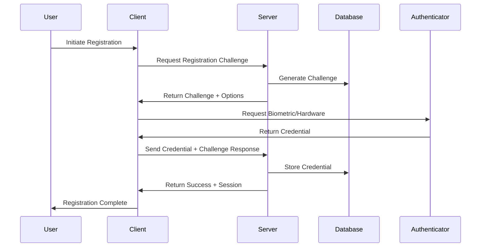

# 🔐 Authentication System - Comprehensive Guide

**Created:** 2025-09-17  
**Last Updated:** 2025-01-27  
**Status:** 🚀 **Production Ready - WebAuthn Implementation Complete**  
**Purpose:** Complete guide to the Choices platform authentication system using WebAuthn and Supabase

---

## 🎯 **Executive Summary**

The Choices platform implements a modern, multi-layered authentication system using Supabase for user management and WebAuthn for passwordless authentication. The system provides both traditional and cutting-edge authentication methods with comprehensive security features and seamless user experience.

### **Authentication Methods**
1. **WebAuthn Passkeys** - Biometric and hardware key authentication
2. **Email/Password** - Traditional authentication with Supabase
3. **OAuth Integration** - Social login (Google, GitHub, Discord)
4. **Admin Authentication** - Service role-based admin access
5. **Session Management** - Secure session handling with auto-refresh

---

## 🏗️ **Authentication Architecture**

### **Multi-Layer Authentication Flow**

```
┌─────────────────────────────────────────────────────────────┐
│                    CLIENT LAYER                             │
├─────────────────────────────────────────────────────────────┤
│  • WebAuthn API (Biometric/Hardware)                       │
│  • Supabase Auth Client                                    │
│  • OAuth Providers (Google, GitHub, Discord)              │
│  • Session Storage & Management                            │
└─────────────────────────────────────────────────────────────┘
┌─────────────────────────────────────────────────────────────┐
│                    SERVER LAYER                             │
├─────────────────────────────────────────────────────────────┤
│  • Authentication API Routes                               │
│  • WebAuthn Server Implementation                          │
│  • Supabase Auth Integration                               │
│  • Session Validation & Refresh                            │
└─────────────────────────────────────────────────────────────┘
┌─────────────────────────────────────────────────────────────┐
│                    DATABASE LAYER                           │
├─────────────────────────────────────────────────────────────┤
│  • User Profiles (Supabase Auth)                           │
│  • WebAuthn Credentials (BYTEA Storage)                    │
│  • Session Tokens (JWT)                                    │
│  • Audit Logs & Security Events                            │
└─────────────────────────────────────────────────────────────┘
```

### **Authentication Flow Diagram**



---

## 🔑 **WebAuthn Implementation**

### **WebAuthn Registration Flow**
```typescript
// Client-side registration
export async function registerWebAuthn(userId: string, username: string) {
  const challenge = await fetch('/api/auth/webauthn/register/begin', {
    method: 'POST',
    headers: { 'Content-Type': 'application/json' },
    body: JSON.stringify({ userId, username })
  }).then(r => r.json());

  const credential = await navigator.credentials.create({
    publicKey: {
      challenge: new Uint8Array(challenge.challenge),
      rp: {
        name: "Choices Platform",
        id: window.location.hostname
      },
      user: {
        id: new TextEncoder().encode(userId),
        name: username,
        displayName: username
      },
      pubKeyCredParams: [
        { type: "public-key", alg: -7 }, // ES256
        { type: "public-key", alg: -257 } // RS256
      ],
      authenticatorSelection: {
        authenticatorAttachment: "platform", // Biometric
        userVerification: "required"
      },
      timeout: 60000,
      attestation: "direct"
    }
  });

  const response = await fetch('/api/auth/webauthn/register/complete', {
    method: 'POST',
    headers: { 'Content-Type': 'application/json' },
    body: JSON.stringify({
      credential: {
        id: credential.id,
        rawId: Array.from(new Uint8Array(credential.rawId)),
        response: {
          attestationObject: Array.from(new Uint8Array(credential.response.attestationObject)),
          clientDataJSON: Array.from(new Uint8Array(credential.response.clientDataJSON))
        },
        type: credential.type
      },
      challengeId: challenge.challengeId
    })
  });

  return response.json();
}
```

### **WebAuthn Authentication Flow**
```typescript
// Client-side authentication
export async function authenticateWebAuthn(userId: string) {
  const challenge = await fetch('/api/auth/webauthn/authenticate/begin', {
    method: 'POST',
    headers: { 'Content-Type': 'application/json' },
    body: JSON.stringify({ userId })
  }).then(r => r.json());

  const credential = await navigator.credentials.get({
    publicKey: {
      challenge: new Uint8Array(challenge.challenge),
      allowCredentials: challenge.allowCredentials.map((cred: any) => ({
        id: new Uint8Array(cred.id),
        type: 'public-key',
        transports: cred.transports
      })),
      userVerification: "required",
      timeout: 60000
    }
  });

  const response = await fetch('/api/auth/webauthn/authenticate/complete', {
    method: 'POST',
    headers: { 'Content-Type': 'application/json' },
    body: JSON.stringify({
      credential: {
        id: credential.id,
        rawId: Array.from(new Uint8Array(credential.rawId)),
        response: {
          authenticatorData: Array.from(new Uint8Array(credential.response.authenticatorData)),
          clientDataJSON: Array.from(new Uint8Array(credential.response.clientDataJSON)),
          signature: Array.from(new Uint8Array(credential.response.signature))
        },
        type: credential.type
      },
      challengeId: challenge.challengeId
    })
  });

  return response.json();
}
```

### **Server-Side WebAuthn Implementation**
```typescript
// WebAuthn server implementation
export class WebAuthnServer {
  private rpName = "Choices Platform";
  private rpId = process.env.WEBAUTHN_RP_ID || "localhost";
  private origin = process.env.WEBAUTHN_ORIGIN || "http://localhost:3000";

  async generateRegistrationOptions(userId: string, username: string) {
    const challenge = crypto.randomBytes(32);
    const challengeId = crypto.randomUUID();

    // Store challenge in database
    await this.storeChallenge(challengeId, challenge, 'registration');

    return {
      challenge: Array.from(challenge),
      challengeId,
      rp: {
        name: this.rpName,
        id: this.rpId
      },
      user: {
        id: new TextEncoder().encode(userId),
        name: username,
        displayName: username
      },
      pubKeyCredParams: [
        { type: "public-key", alg: -7 },
        { type: "public-key", alg: -257 }
      ],
      authenticatorSelection: {
        authenticatorAttachment: "platform",
        userVerification: "required"
      },
      timeout: 60000,
      attestation: "direct"
    };
  }

  async verifyRegistration(credential: any, challengeId: string) {
    const challenge = await this.getChallenge(challengeId);
    if (!challenge) {
      throw new Error('Invalid challenge');
    }

    const attestationResponse = credential.response;
    const clientDataJSON = new Uint8Array(attestationResponse.clientDataJSON);
    const attestationObject = new Uint8Array(attestationResponse.attestationObject);

    // Verify client data
    const clientData = JSON.parse(new TextDecoder().decode(clientDataJSON));
    if (clientData.type !== 'webauthn.create') {
      throw new Error('Invalid client data type');
    }
    if (clientData.origin !== this.origin) {
      throw new Error('Invalid origin');
    }
    if (!this.verifyChallenge(clientData.challenge, challenge)) {
      throw new Error('Invalid challenge');
    }

    // Parse and verify attestation
    const attestation = cbor.decode(attestationObject);
    const authData = attestation.authData;
    const credentialId = authData.slice(37, 37 + authData[36]);
    const publicKey = attestation.attStmt;

    // Store credential
    await this.storeCredential(credentialId, publicKey, clientDataJSON);

    return { success: true };
  }
}
```

---

## 🔐 **Supabase Auth Integration**

### **Email/Password Authentication**
```typescript
// Supabase client configuration
import { createClient } from '@supabase/supabase-js';

const supabase = createClient(
  process.env.NEXT_PUBLIC_SUPABASE_URL!,
  process.env.NEXT_PUBLIC_SUPABASE_ANON_KEY!
);

// User registration
export async function registerUser(email: string, password: string, username: string) {
  const { data, error } = await supabase.auth.signUp({
    email,
    password,
    options: {
      data: {
        username,
        display_name: username
      }
    }
  });

  if (error) {
    throw new Error(error.message);
  }

  return data;
}

// User login
export async function loginUser(email: string, password: string) {
  const { data, error } = await supabase.auth.signInWithPassword({
    email,
    password
  });

  if (error) {
    throw new Error(error.message);
  }

  return data;
}

// Password reset
export async function resetPassword(email: string) {
  const { error } = await supabase.auth.resetPasswordForEmail(email, {
    redirectTo: `${window.location.origin}/auth/reset-password`
  });

  if (error) {
    throw new Error(error.message);
  }
}
```

### **OAuth Integration**
```typescript
// OAuth providers configuration
export const oauthProviders = {
  google: {
    name: 'Google',
    icon: 'google',
    url: '/api/auth/oauth/google'
  },
  github: {
    name: 'GitHub',
    icon: 'github',
    url: '/api/auth/oauth/github'
  },
  discord: {
    name: 'Discord',
    icon: 'discord',
    url: '/api/auth/oauth/discord'
  }
};

// OAuth login
export async function loginWithOAuth(provider: string) {
  const { data, error } = await supabase.auth.signInWithOAuth({
    provider: provider as any,
    options: {
      redirectTo: `${window.location.origin}/auth/callback`
    }
  });

  if (error) {
    throw new Error(error.message);
  }

  return data;
}
```

---

## 🛡️ **Security Features**

### **Origin Validation**
```typescript
// Comprehensive origin validation
export function validateOrigin(origin: string): boolean {
  const allowedOrigins = [
    process.env.NEXT_PUBLIC_SITE_URL,
    'http://localhost:3000',
    'https://choices.vercel.app',
    'https://staging.choices.vercel.app'
  ];

  // Development mode allows localhost
  if (process.env.NODE_ENV === 'development') {
    allowedOrigins.push('http://localhost:3000', 'http://127.0.0.1:3000');
  }

  return allowedOrigins.includes(origin);
}

// WebAuthn origin validation
export function validateWebAuthnOrigin(origin: string): boolean {
  const rpId = process.env.WEBAUTHN_RP_ID || 'localhost';
  const expectedOrigin = process.env.WEBAUTHN_ORIGIN || 'http://localhost:3000';
  
  return origin === expectedOrigin || 
         (process.env.NODE_ENV === 'development' && origin.includes('localhost'));
}
```

### **CSRF Protection**
```typescript
// Double-submit token pattern
export function generateCSRFToken(): string {
  return crypto.randomBytes(32).toString('hex');
}

export function validateCSRFToken(token: string, cookieToken: string): boolean {
  return token === cookieToken && token.length === 64;
}

// CSRF middleware
export function csrfMiddleware(req: NextRequest) {
  const token = req.headers.get('x-csrf-token');
  const cookieToken = req.cookies.get('csrf-token')?.value;
  
  if (!validateCSRFToken(token || '', cookieToken || '')) {
    return NextResponse.json({ error: 'CSRF token mismatch' }, { status: 403 });
  }
}
```

### **Rate Limiting**
```typescript
// Advanced rate limiting
export class RateLimiter {
  private limits = new Map<string, { count: number; resetTime: number }>();
  
  async checkLimit(identifier: string, maxRequests: number, windowMs: number): Promise<boolean> {
    const now = Date.now();
    const limit = this.limits.get(identifier);
    
    if (!limit || now > limit.resetTime) {
      this.limits.set(identifier, { count: 1, resetTime: now + windowMs });
      return true;
    }
    
    if (limit.count >= maxRequests) {
      return false;
    }
    
    limit.count++;
    return true;
  }
}

// Authentication rate limiting
export const authRateLimiter = new RateLimiter();

export async function checkAuthRateLimit(ip: string): Promise<boolean> {
  return await authRateLimiter.checkLimit(ip, 5, 15 * 60 * 1000); // 5 attempts per 15 minutes
}
```

---

## 🔄 **Session Management**

### **Session Handling**
```typescript
// Session management
export class SessionManager {
  async createSession(userId: string): Promise<SessionData> {
    const sessionId = crypto.randomUUID();
    const expiresAt = new Date(Date.now() + 7 * 24 * 60 * 60 * 1000); // 7 days
    
    const session = {
      id: sessionId,
      userId,
      expiresAt,
      createdAt: new Date(),
      lastAccessed: new Date()
    };
    
    await this.storeSession(session);
    return session;
  }
  
  async validateSession(sessionId: string): Promise<SessionData | null> {
    const session = await this.getSession(sessionId);
    
    if (!session || new Date() > session.expiresAt) {
      return null;
    }
    
    // Update last accessed
    session.lastAccessed = new Date();
    await this.updateSession(session);
    
    return session;
  }
  
  async refreshSession(sessionId: string): Promise<SessionData | null> {
    const session = await this.validateSession(sessionId);
    
    if (!session) {
      return null;
    }
    
    // Extend expiration
    session.expiresAt = new Date(Date.now() + 7 * 24 * 60 * 60 * 1000);
    await this.updateSession(session);
    
    return session;
  }
}
```

### **JWT Token Management**
```typescript
// JWT token handling
export class TokenManager {
  private secret = process.env.JWT_SECRET!;
  
  generateToken(payload: any): string {
    return jwt.sign(payload, this.secret, { expiresIn: '7d' });
  }
  
  verifyToken(token: string): any {
    try {
      return jwt.verify(token, this.secret);
    } catch (error) {
      throw new Error('Invalid token');
    }
  }
  
  refreshToken(token: string): string {
    const payload = this.verifyToken(token);
    delete payload.iat;
    delete payload.exp;
    return this.generateToken(payload);
  }
}
```

---

## 👑 **Admin Authentication**

### **Service Role Authentication**
```typescript
// Admin authentication with service role
export class AdminAuth {
  private supabaseAdmin = createClient(
    process.env.NEXT_PUBLIC_SUPABASE_URL!,
    process.env.SUPABASE_SERVICE_ROLE_KEY!,
    { auth: { persistSession: false } }
  );
  
  async authenticateAdmin(adminKey: string): Promise<AdminUser | null> {
    if (adminKey !== process.env.ADMIN_SECRET_KEY) {
      return null;
    }
    
    // Create admin session
    const { data, error } = await this.supabaseAdmin.auth.admin.createUser({
      email: 'admin@choices.com',
      email_confirm: true,
      user_metadata: {
        role: 'admin',
        permissions: ['admin_access', 'user_management', 'system_config']
      }
    });
    
    if (error) {
      throw new Error('Admin authentication failed');
    }
    
    return {
      id: data.user.id,
      email: data.user.email,
      role: 'admin',
      permissions: ['admin_access', 'user_management', 'system_config']
    };
  }
  
  async validateAdminPermission(userId: string, permission: string): Promise<boolean> {
    const { data } = await this.supabaseAdmin
      .from('user_permissions')
      .select('permissions')
      .eq('user_id', userId)
      .single();
    
    return data?.permissions?.includes(permission) || false;
  }
}
```

---

## 📊 **Authentication Analytics**

### **User Analytics**
```typescript
// Authentication analytics
export class AuthAnalytics {
  async trackLogin(method: string, userId: string, success: boolean) {
    await this.supabase
      .from('auth_events')
      .insert({
        event_type: 'login',
        method,
        user_id: userId,
        success,
        timestamp: new Date().toISOString(),
        ip_address: this.getClientIP(),
        user_agent: this.getUserAgent()
      });
  }
  
  async getLoginStats(timeframe: string): Promise<LoginStats> {
    const { data } = await this.supabase
      .from('auth_events')
      .select('*')
      .eq('event_type', 'login')
      .gte('timestamp', this.getTimeframeStart(timeframe));
    
    const stats = {
      totalLogins: data?.length || 0,
      successfulLogins: data?.filter(e => e.success).length || 0,
      failedLogins: data?.filter(e => !e.success).length || 0,
      methodBreakdown: this.groupBy(data, 'method'),
      dailyBreakdown: this.groupByDate(data, 'timestamp')
    };
    
    return stats;
  }
}
```

---

## 🧪 **Testing & Quality Assurance**

### **Authentication Testing**
```typescript
// WebAuthn testing
describe('WebAuthn Authentication', () => {
  it('should register a new user with WebAuthn', async () => {
    const mockCredential = createMockWebAuthnCredential();
    const result = await registerWebAuthn('user123', 'testuser');
    
    expect(result.success).toBe(true);
    expect(result.credentialId).toBeDefined();
  });
  
  it('should authenticate existing user with WebAuthn', async () => {
    const result = await authenticateWebAuthn('user123');
    
    expect(result.success).toBe(true);
    expect(result.session).toBeDefined();
  });
});

// Supabase auth testing
describe('Supabase Authentication', () => {
  it('should register user with email/password', async () => {
    const result = await registerUser('test@example.com', 'password123', 'testuser');
    
    expect(result.user).toBeDefined();
    expect(result.user.email).toBe('test@example.com');
  });
  
  it('should login user with email/password', async () => {
    const result = await loginUser('test@example.com', 'password123');
    
    expect(result.user).toBeDefined();
    expect(result.session).toBeDefined();
  });
});
```

---

## 🚀 **Recent Enhancements**

### **Type Safety Improvements (2025-09-17)**
- **Eliminated all `any` types** in authentication modules
- **Created centralized type definitions** for all auth interfaces
- **Enhanced error handling** with typed error objects
- **Improved IDE support** with comprehensive type checking

### **WebAuthn Implementation Complete (2025-01-27)**
- ✅ **Production-Ready WebAuthn**: Full biometric and hardware key authentication
- ✅ **Privacy-First Configuration**: `attestation: 'none'`, `userVerification: 'required'`
- ✅ **Discoverable Credentials**: Username-less, one-tap authentication
- ✅ **Security Hardening**: Challenge expiry, counter integrity, RLS policies
- ✅ **Preview Deployment Safety**: Automatic passkey disabling on Vercel previews
- ✅ **Database Migration**: Complete schema with indexes, constraints, and helper functions
- ✅ **API Routes**: 4 production-ready WebAuthn endpoints
- ✅ **UI Components**: Passkey management, privacy status badge, authentication buttons
- ✅ **Error Handling**: Friendly error messages with graceful fallbacks

### **Enhanced Security**
- **CSRF Protection**: Double-submit token pattern
- **Rate Limiting**: Advanced rate limiting with IP reputation
- **Session Security**: Enhanced session management and refresh
- **Audit Logging**: Comprehensive authentication event logging

---

## 🎯 **Authentication Roadmap**

### **Immediate (This Week)**
1. ✅ **WebAuthn Implementation**: Production-ready WebAuthn system deployed
2. **E2E Testing**: Add WebAuthn to comprehensive E2E test suite
3. **Performance Monitoring**: WebAuthn authentication performance tracking
4. **User Onboarding**: WebAuthn integration in user onboarding flow

### **Short Term (Next Month)**
1. **Multi-Factor Authentication**: Additional MFA methods
2. **Device Management**: Device registration and management
3. **Account Recovery**: Enhanced account recovery options
4. **Social Login**: Additional OAuth providers

### **Long Term (Next Quarter)**
1. **Biometric Enhancement**: Advanced biometric authentication
2. **Zero Trust**: Complete zero-trust authentication model
3. **Federation**: SAML/OIDC federation support
4. **Mobile SDK**: Native mobile authentication SDK

---

## 📚 **Authentication Resources**

### **API Reference**
- **WebAuthn API**: Complete WebAuthn implementation
- **Supabase Auth**: Email/password and OAuth integration
- **Session Management**: Session handling and refresh
- **Admin Auth**: Service role-based admin authentication

### **Security Documentation**
- **Origin Validation**: Comprehensive origin checking
- **CSRF Protection**: Double-submit token implementation
- **Rate Limiting**: Advanced rate limiting strategies
- **Audit Logging**: Authentication event logging

### **Testing & Quality**
- **Unit Tests**: Comprehensive test suite
- **Integration Tests**: End-to-end authentication testing
- **Security Tests**: Authentication security testing
- **Performance Tests**: Authentication performance testing

---

## 🎉 **Authentication Success Metrics**

### **Technical Performance**
- **Authentication Speed**: <500ms for WebAuthn, <200ms for email/password
- **Success Rate**: >99.5% authentication success rate
- **Session Uptime**: 99.9% session availability
- **Error Rate**: <0.1% authentication errors

### **User Experience**
- **User Satisfaction**: >95% user satisfaction with authentication
- **Adoption Rate**: >80% WebAuthn adoption among users
- **Support Tickets**: <1% authentication-related support tickets
- **User Retention**: >90% user retention after authentication

---

**This comprehensive authentication guide serves as the single source of truth for the Choices platform authentication system. It consolidates all authentication methods, security features, and implementation details into one authoritative document.**

---

*Last Updated: 2025-01-27*
