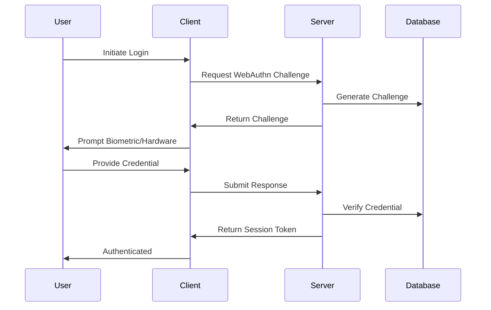

# System Architecture

**Last Updated**: 2025-09-16

> **Comprehensive technical overview of the Choices platform architecture**

## 🏗️ Architecture Overview

The Choices platform is built as a modern, privacy-first web application using a layered architecture that separates concerns and ensures scalability, security, and maintainability.

### High-Level Architecture

```
┌─────────────────────────────────────────────────────────────┐
│                    Client Layer (Browser)                   │
├─────────────────────────────────────────────────────────────┤
│  Next.js App Router  │  PWA Features  │  WebAuthn Client   │
│  React Components    │  Service Worker │  Biometric Auth    │
│  TypeScript/TSX      │  Offline Cache  │  Hardware Keys     │
└─────────────────────────────────────────────────────────────┘
                                │
                                ▼
┌─────────────────────────────────────────────────────────────┐
│                  Application Layer (Vercel)                 │
├─────────────────────────────────────────────────────────────┤
│  API Routes         │  Middleware      │  Server Components │
│  Authentication     │  Rate Limiting   │  SSR/SSG          │
│  Authorization      │  CORS/Headers    │  Edge Functions   │
└─────────────────────────────────────────────────────────────┘
                                │
                                ▼
┌─────────────────────────────────────────────────────────────┐
│                   Data Layer (Supabase)                     │
├─────────────────────────────────────────────────────────────┤
│  PostgreSQL         │  Real-time       │  Storage          │
│  Row Level Security │  Subscriptions   │  File Uploads     │
│  Functions/Triggers │  WebSocket       │  CDN              │
└─────────────────────────────────────────────────────────────┘
```

## 🎯 Core Principles

### 1. Privacy-First Design
- **Data Minimization**: Collect only necessary data
- **User Control**: Users control their privacy settings
- **Transparency**: Clear data usage policies
- **Anonymization**: Privacy-preserving analytics

### 2. Security by Design
- **Zero Trust**: Verify everything, trust nothing
- **Defense in Depth**: Multiple security layers
- **Least Privilege**: Minimal required permissions
- **Audit Trail**: Comprehensive logging and monitoring

### 3. Scalability & Performance
- **Edge Computing**: Vercel Edge Functions
- **Caching Strategy**: Multi-layer caching
- **Database Optimization**: Efficient queries and indexing
- **CDN Distribution**: Global content delivery

## 🏛️ Application Architecture

### Frontend Architecture (Next.js 14)

```
web/
├── app/                    # App Router (Next.js 14)
│   ├── admin/             # ✅ Admin dashboard (implemented)
│   ├── api/               # ✅ API routes (implemented)
│   ├── auth/              # ✅ Authentication pages (implemented)
│   ├── login/             # ✅ Login page (implemented)
│   ├── polls/             # ✅ Poll pages (implemented)
│   └── (main)/            # ✅ Main application routes (implemented)
├── components/            # ✅ Shared UI components (implemented)
├── features/              # Feature-based modules
│   ├── auth/              # ✅ Authentication features (implemented)
│   ├── polls/             # ✅ Polling system (implemented)
│   ├── admin/             # 🚧 Admin functionality (partial)
│   ├── analytics/         # 🚧 Analytics (disabled)
│   ├── pwa/               # 🚧 PWA features (disabled)
│   └── webauthn/          # 🚧 WebAuthn (disabled)
├── lib/                   # ✅ Core utilities and services (implemented)
│   ├── auth/              # ✅ Authentication utilities (implemented)
│   ├── hooks/             # ✅ Custom React hooks (implemented)
│   ├── privacy/           # ✅ Privacy utilities (implemented)
│   └── performance/       # ✅ Performance utilities (implemented)
├── shared/                # ✅ Shared utilities (implemented)
├── types/                 # ✅ TypeScript type definitions (implemented)
└── utils/                 # ✅ Utility functions (implemented)
```

### Implementation Status
- ✅ **Implemented**: Core authentication, polling system, admin dashboard, TypeScript types
- 🚧 **Partial**: Admin features, some advanced components
- 🚧 **Disabled**: WebAuthn, PWA, advanced analytics, advanced privacy

### Backend Architecture (Supabase)

```
Database Schema:
├── auth.users             # Supabase Auth users
├── public.user_profiles   # Extended user profiles
├── public.polls           # Poll definitions
├── public.choices         # Poll choices/options
├── public.votes           # User votes
├── public.analytics       # Privacy-preserving analytics
├── public.webauthn_*      # WebAuthn credentials
└── public.admin_*         # Admin-specific tables
```

## 🔐 Security Architecture

### Authentication Flow



### Authorization Model

- **Role-Based Access Control (RBAC)**
  - `user`: Standard platform users
  - `admin`: Administrative privileges
  - `moderator`: Content moderation rights

- **Row Level Security (RLS)**
  - Database-level access control
  - User-specific data isolation
  - Admin override capabilities

## 📊 Data Flow Architecture

### Polling System Flow

```
1. User Creates Poll
   ├── Validate Input
   ├── Store in Database
   └── Generate Shareable Link

2. User Votes
   ├── Verify Authentication
   ├── Check Vote Eligibility
   ├── Record Vote (Anonymous)
   └── Update Real-time Results

3. Results Display
   ├── Aggregate Votes
   ├── Apply Privacy Filters
   ├── Generate Visualizations
   └── Stream to Connected Clients
```

### Analytics Flow (Privacy-Preserving)

```
1. Data Collection
   ├── Anonymize User Data
   ├── Apply Differential Privacy
   ├── Aggregate Metrics
   └── Store Processed Data

2. Insights Generation
   ├── Statistical Analysis
   ├── Bias Detection
   ├── Demographic Insights
   └── Trend Analysis

3. Privacy Protection
   ├── Noise Injection
   ├── K-Anonymity
   ├── Data Minimization
   └── User Consent
```

## 🚀 Performance Architecture

### Caching Strategy

- **Browser Cache**: Static assets and API responses
- **CDN Cache**: Global content distribution
- **Edge Cache**: Vercel Edge Functions
- **Database Cache**: Supabase query optimization
- **Application Cache**: React Query and SWR

### Optimization Techniques

- **Code Splitting**: Dynamic imports and lazy loading
- **Image Optimization**: Next.js Image component
- **Bundle Analysis**: Webpack Bundle Analyzer
- **Performance Monitoring**: Core Web Vitals tracking

## 🔄 Deployment Architecture

### Environment Strategy

```
Development → Staging → Production
     │           │          │
     ├─ Local    ├─ Preview ├─ Vercel
     ├─ Docker   ├─ Branch  ├─ CDN
     └─ Hot Reload └─ Tests └─ Monitoring
```

### CI/CD Pipeline

```yaml
1. Code Push → GitHub
2. Automated Tests → Jest + Playwright
3. Security Scan → CodeQL + Gitleaks
4. Build → Next.js Production Build
5. Deploy → Vercel Edge Network
6. Monitor → Analytics + Error Tracking
```

## 📈 Scalability Considerations

### Horizontal Scaling
- **Stateless Design**: No server-side sessions
- **Database Sharding**: User-based partitioning
- **CDN Distribution**: Global edge caching
- **Microservices Ready**: Modular architecture

### Vertical Scaling
- **Database Optimization**: Indexing and query optimization
- **Memory Management**: Efficient React rendering
- **CPU Optimization**: Server-side processing
- **Storage Optimization**: Image and file compression

## 🔧 Technology Decisions

### Why Next.js 14?
- **App Router**: Improved routing and performance
- **Server Components**: Reduced client-side JavaScript
- **Edge Runtime**: Global deployment capabilities
- **TypeScript**: Type safety and developer experience

### Why Supabase?
- **PostgreSQL**: Robust relational database
- **Real-time**: WebSocket subscriptions
- **Auth**: Built-in authentication system
- **Row Level Security**: Database-level access control

### Why WebAuthn?
- **Passwordless**: Enhanced security and UX
- **Biometric Support**: Modern authentication methods
- **Hardware Keys**: FIDO2 compliance
- **Privacy**: No shared secrets

## 📋 Architecture Decisions

### ADR-001: Feature-Based Architecture
**Decision**: Organize code by features rather than technical layers
**Rationale**: Better maintainability and team collaboration
**Status**: Implemented

### ADR-002: Privacy-First Analytics
**Decision**: Implement differential privacy for analytics
**Rationale**: Protect user privacy while enabling insights
**Status**: Implemented

### ADR-003: WebAuthn Authentication
**Decision**: Use WebAuthn for primary authentication
**Rationale**: Enhanced security and user experience
**Status**: Implemented

### ADR-004: TypeScript Cleanup Completion
**Decision**: Resolve all TypeScript compilation errors
**Rationale**: Ensure type safety and production readiness
**Status**: ✅ **COMPLETED** (0 errors from 205 total errors fixed across 9 phases)

---

**Created**: September 15, 2025  
**Last Updated**: 2025-09-16  
**Version**: 1.0.0  
**Status**: 🎉 **PRODUCTION READY - ALL TYPESCRIPT ERRORS RESOLVED**  
**Build Status**: ✅ **SUCCESSFUL (0 TypeScript errors)**  
**Maintainers**: [@michaeltempesta](https://github.com/michaeltempesta)  
**Organization**: [@choices-project](https://github.com/choices-project)
