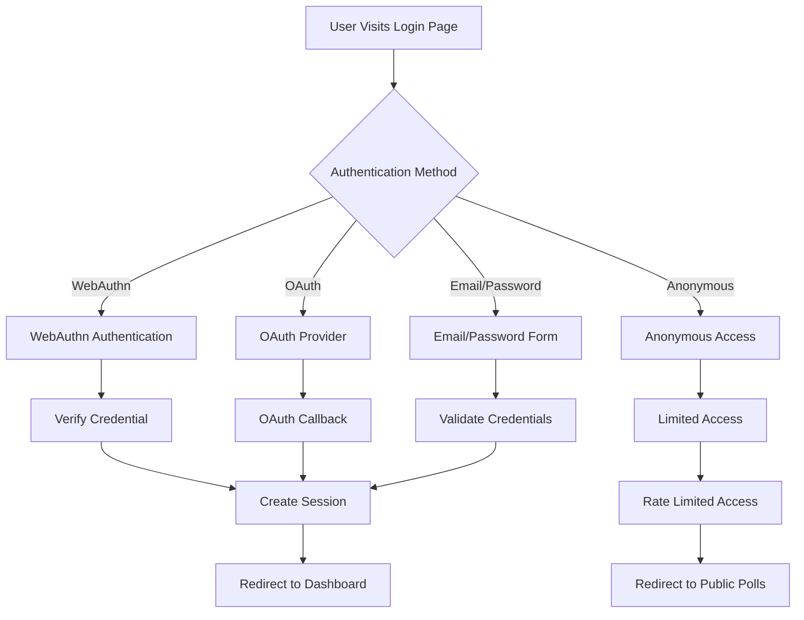
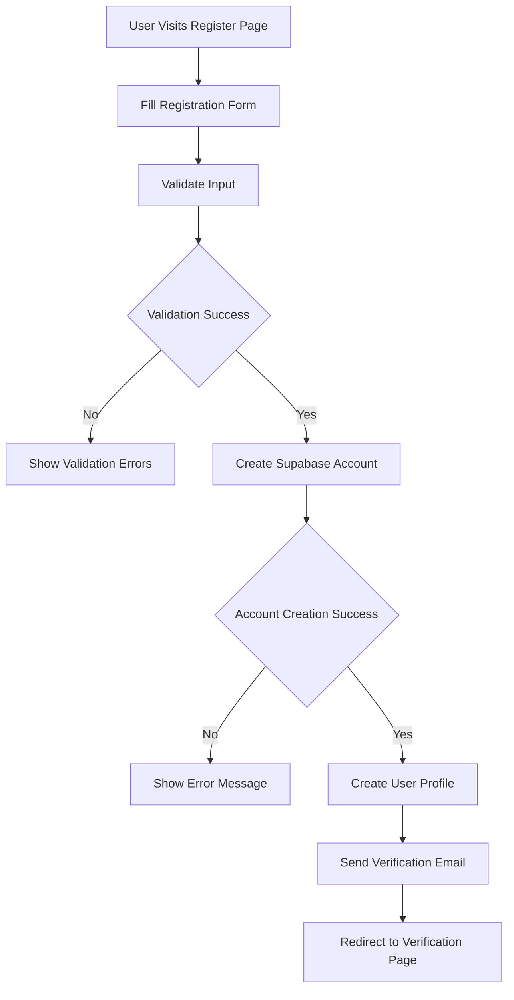

# 🔐 Authentication System

**Complete Authentication Documentation for Choices Platform**

---

## 🎯 **Overview**

The Choices platform implements a comprehensive authentication system with WebAuthn passwordless authentication, social login, and sophisticated trust tier management.

**Last Updated**: October 27, 2025  
**Status**: Production Ready  
**Security Level**: Enterprise-Grade

---

## 🔑 **Authentication Methods**

### **WebAuthn (Primary)**
- **Passwordless Authentication**: Biometric and hardware key support
- **Cross-Device Authentication**: QR code-based authentication
- **FIDO2 Compliance**: Industry-standard security protocols
- **Privacy-First**: No passwords stored or transmitted

### **Social Login (Secondary)**
- **Google OAuth**: Google account integration
- **GitHub OAuth**: GitHub account integration
- **Microsoft OAuth**: Microsoft account integration
- **Secure Token Management**: JWT-based session handling

### **Email/Password (Fallback)**
- **Traditional Authentication**: Email and password login
- **Secure Password Storage**: Bcrypt hashing
- **Email Verification**: Account verification required
- **Password Reset**: Secure password reset flow

### **Anonymous Access (Limited)**
- **Viral Growth**: Anonymous users can vote on shared polls
- **Rate Limiting**: Limited requests per hour
- **Trust Progression**: Incentive to create account
- **Privacy Protection**: No personal data collection

---

## 🛡️ **Trust Tier System**

### **Trust Tier Levels**
```typescript
enum TrustTier {
  ANONYMOUS = 'anonymous',    // Level 0 - Limited access
  NEW = 'new',               // Level 1 - Basic access
  ESTABLISHED = 'established', // Level 2 - Enhanced access
  VERIFIED = 'verified'      // Level 3 - Full access
}
```

### **Trust Tier Permissions**
```typescript
const trustTierPermissions = {
  anonymous: {
    canVote: true,
    canViewPublic: true,
    rateLimit: 100,
    analyticsAccess: false,
    pollCreation: false
  },
  new: {
    canVote: true,
    canCreatePolls: true,
    canViewPublic: true,
    rateLimit: 500,
    analyticsAccess: false,
    pollCreation: true
  },
  established: {
    canVote: true,
    canCreatePolls: true,
    canViewPublic: true,
    canViewAnalytics: true,
    rateLimit: 1000,
    analyticsAccess: true,
    pollCreation: true
  },
  verified: {
    canVote: true,
    canCreatePolls: true,
    canViewPublic: true,
    canViewAnalytics: true,
    canAdmin: true,
    rateLimit: 5000,
    analyticsAccess: true,
    pollCreation: true
  }
};
```

### **Trust Progression**
- **Anonymous → New**: Create account with email verification
- **New → Established**: Active participation and engagement
- **Established → Verified**: Community verification and admin approval

---

## 🔧 **Implementation Details**

### **WebAuthn Integration**
```typescript
// WebAuthn Registration
const registerWebAuthn = async (user: User) => {
  const credential = await navigator.credentials.create({
    publicKey: {
      challenge: new Uint8Array(32),
      rp: {
        name: "Choices Platform",
        id: "choices-platform.vercel.app"
      },
      user: {
        id: new TextEncoder().encode(user.id),
        name: user.email,
        displayName: user.name
      },
      pubKeyCredParams: [
        { type: "public-key", alg: -7 }, // ES256
        { type: "public-key", alg: -257 } // RS256
      ],
      authenticatorSelection: {
        authenticatorAttachment: "platform",
        userVerification: "required"
      },
      timeout: 60000,
      attestation: "direct"
    }
  });
  
  return credential;
};

// WebAuthn Authentication
const authenticateWebAuthn = async (user: User) => {
  const credential = await navigator.credentials.get({
    publicKey: {
      challenge: new Uint8Array(32),
      allowCredentials: [{
        id: user.webauthnId,
        type: "public-key",
        transports: ["internal", "usb", "nfc", "ble"]
      }],
      timeout: 60000,
      userVerification: "required"
    }
  });
  
  return credential;
};
```

### **Supabase Auth Integration**
```typescript
// Supabase Auth Configuration
const supabaseAuth = createClient(
  process.env.NEXT_PUBLIC_SUPABASE_URL!,
  process.env.NEXT_PUBLIC_SUPABASE_ANON_KEY!
);

// Sign in with WebAuthn
const signInWithWebAuthn = async (email: string) => {
  const { data, error } = await supabaseAuth.auth.signInWithOtp({
    email,
    options: {
      emailRedirectTo: `${window.location.origin}/auth/callback`
    }
  });
  
  return { data, error };
};

// Sign in with OAuth
const signInWithOAuth = async (provider: 'google' | 'github' | 'microsoft') => {
  const { data, error } = await supabaseAuth.auth.signInWithOAuth({
    provider,
    options: {
      redirectTo: `${window.location.origin}/auth/callback`
    }
  });
  
  return { data, error };
};
```

---

## 🔐 **Security Features**

### **Session Management**
```typescript
// Secure Session Configuration
const sessionConfig = {
  httpOnly: true,
  secure: process.env.NODE_ENV === 'production',
  sameSite: 'strict' as const,
  maxAge: 7 * 24 * 60 * 60 * 1000, // 7 days
  path: '/'
};

// Session Validation
const validateSession = async (session: Session) => {
  if (!session?.user) {
    throw new Error('No valid session');
  }
  
  // Check if user still exists and is active
  const { data: user, error } = await supabase
    .from('users')
    .select('*')
    .eq('id', session.user.id)
    .single();
    
  if (error || !user) {
    throw new Error('User not found');
  }
  
  return user;
};
```

### **Rate Limiting**
```typescript
// Rate Limiting by Trust Tier
const rateLimits = {
  anonymous: { requests: 100, window: '1h' },
  new: { requests: 500, window: '1h' },
  established: { requests: 1000, window: '1h' },
  verified: { requests: 5000, window: '1h' }
};

// Rate Limiting Middleware
const rateLimitMiddleware = (trustTier: TrustTier) => {
  const limit = rateLimits[trustTier];
  
  return rateLimit({
    windowMs: limit.window,
    max: limit.requests,
    message: 'Rate limit exceeded',
    standardHeaders: true,
    legacyHeaders: false
  });
};
```

### **Security Monitoring**
```typescript
// Security Event Logging
const logSecurityEvent = (event: SecurityEvent) => {
  const securityEvent = {
    type: event.type,
    user_id: event.userId,
    ip_address: event.ip,
    user_agent: event.userAgent,
    timestamp: new Date().toISOString(),
    metadata: event.metadata
  };
  
  // Log to security monitoring system
  console.log('Security Event:', securityEvent);
  
  // Store in database for analysis
  supabase.from('security_events').insert(securityEvent);
};

// Anomaly Detection
const detectAnomalies = (user: User, action: string) => {
  // Check for unusual patterns
  const anomalies = [];
  
  // Check rate limiting
  if (user.requestCount > user.trustTier.limit) {
    anomalies.push('rate_limit_exceeded');
  }
  
  // Check geographic anomalies
  if (user.lastLocation !== user.currentLocation) {
    anomalies.push('geographic_anomaly');
  }
  
  return anomalies;
};
```

---

## 📊 **User Management**

### **User Registration**
```typescript
// User Registration Flow
const registerUser = async (userData: RegisterUserData) => {
  // Validate input
  const validatedData = registerUserSchema.parse(userData);
  
  // Check if user already exists
  const { data: existingUser } = await supabase
    .from('users')
    .select('id')
    .eq('email', validatedData.email)
    .single();
    
  if (existingUser) {
    throw new Error('User already exists');
  }
  
  // Create user account
  const { data: authUser, error: authError } = await supabase.auth.signUp({
    email: validatedData.email,
    password: validatedData.password,
    options: {
      data: {
        name: validatedData.name
      }
    }
  });
  
  if (authError) {
    throw new Error(authError.message);
  }
  
  // Create user profile
  const { data: user, error: userError } = await supabase
    .from('users')
    .insert({
      id: authUser.user?.id,
      email: validatedData.email,
      name: validatedData.name,
      trust_tier: 'new'
    })
    .select()
    .single();
    
  if (userError) {
    throw new Error(userError.message);
  }
  
  return user;
};
```

### **User Profile Management**
```typescript
// Update User Profile
const updateUserProfile = async (userId: string, updates: Partial<UserProfile>) => {
  const { data, error } = await supabase
    .from('users')
    .update({
      ...updates,
      updated_at: new Date().toISOString()
    })
    .eq('id', userId)
    .select()
    .single();
    
  if (error) {
    throw new Error(error.message);
  }
  
  return data;
};

// Get User Profile
const getUserProfile = async (userId: string) => {
  const { data, error } = await supabase
    .from('users')
    .select('*')
    .eq('id', userId)
    .single();
    
  if (error) {
    throw new Error(error.message);
  }
  
  return data;
};
```

### **Trust Tier Management**
```typescript
// Promote User Trust Tier
const promoteUserTrustTier = async (
  userId: string,
  newTier: TrustTier,
  reason: string,
  promotedBy: string
) => {
  // Get current tier
  const { data: user } = await supabase
    .from('users')
    .select('trust_tier')
    .eq('id', userId)
    .single();
    
  const oldTier = user?.trust_tier;
  
  // Update user tier
  const { data, error } = await supabase
    .from('users')
    .update({
      trust_tier: newTier,
      updated_at: new Date().toISOString()
    })
    .eq('id', userId)
    .select()
    .single();
    
  if (error) {
    throw new Error(error.message);
  }
  
  // Log the change
  await supabase
    .from('user_trust_history')
    .insert({
      user_id: userId,
      old_tier: oldTier,
      new_tier: newTier,
      reason,
      changed_by: promotedBy
    });
    
  return data;
};
```

---

## 🔄 **Authentication Flow**

### **Login Flow**


### **Registration Flow**


---

## 🛠️ **API Endpoints**

### **Authentication Endpoints**
```typescript
// POST /api/auth/register
const registerEndpoint = {
  method: 'POST',
  path: '/api/auth/register',
  body: {
    email: string,
    password: string,
    name: string
  },
  response: {
    user: User,
    session: Session
  }
};

// POST /api/auth/login
const loginEndpoint = {
  method: 'POST',
  path: '/api/auth/login',
  body: {
    email: string,
    password: string
  },
  response: {
    user: User,
    session: Session
  }
};

// POST /api/auth/webauthn/register
const webauthnRegisterEndpoint = {
  method: 'POST',
  path: '/api/auth/webauthn/register',
  body: {
    credential: Credential
  },
  response: {
    success: boolean,
    user: User
  }
};

// POST /api/auth/webauthn/authenticate
const webauthnAuthenticateEndpoint = {
  method: 'POST',
  path: '/api/auth/webauthn/authenticate',
  body: {
    credential: Credential
  },
  response: {
    success: boolean,
    user: User
  }
};
```

---

## 🔍 **Testing**

### **Authentication Tests**
```typescript
// WebAuthn Registration Test
describe('WebAuthn Registration', () => {
  it('should register user with WebAuthn', async () => {
    const user = await createTestUser();
    const credential = await mockWebAuthnCredential();
    
    const response = await request(app)
      .post('/api/auth/webauthn/register')
      .send({ credential })
      .expect(200);
      
    expect(response.body.success).toBe(true);
    expect(response.body.user.id).toBe(user.id);
  });
});

// Trust Tier Test
describe('Trust Tier System', () => {
  it('should promote user trust tier', async () => {
    const user = await createTestUser({ trust_tier: 'new' });
    const admin = await createTestAdmin();
    
    const response = await request(app)
      .post(`/api/admin/users/${user.id}/promote`)
      .set('Authorization', `Bearer ${admin.token}`)
      .send({
        new_tier: 'established',
        reason: 'Active participation'
      })
      .expect(200);
      
    expect(response.body.user.trust_tier).toBe('established');
  });
});
```

---

## 🎯 **Best Practices**

### **Security Best Practices**
- **Use WebAuthn**: Prefer passwordless authentication
- **Validate Input**: Always validate user input
- **Rate Limiting**: Implement appropriate rate limits
- **Session Security**: Use secure session management
- **Monitor Anomalies**: Track unusual authentication patterns

### **User Experience Best Practices**
- **Progressive Enhancement**: Support multiple auth methods
- **Clear Error Messages**: Provide helpful error feedback
- **Trust Progression**: Show clear path to higher trust tiers
- **Privacy Transparency**: Be clear about data collection

---

**Authentication Documentation Version**: 1.0.0  
**Last Updated**: October 27, 2025  
**Status**: ✅ Production Ready

---

*This authentication documentation provides complete coverage of the Choices platform authentication system.*