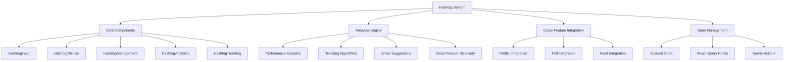

# Hashtag System Documentation

**Created:** October 10, 2025  
**Status:** ✅ PRODUCTION READY  
**Version:** 1.0.0

## Overview

The Hashtag System is a comprehensive, cross-feature integration that enables content discovery, trending analysis, and user interest tracking across the entire platform. Built with advanced analytics, smart suggestions, and real-time trending algorithms.

## Table of Contents

- [Architecture](#architecture)
- [Core Features](#core-features)
- [Components](#components)
- [Services](#services)
- [API Endpoints](#api-endpoints)
- [State Management](#state-management)
- [Cross-Feature Integration](#cross-feature-integration)
- [Analytics & Insights](#analytics--insights)
- [Performance](#performance)
- [Security](#security)
- [Usage Examples](#usage-examples)
- [Migration Guide](#migration-guide)
- [Troubleshooting](#troubleshooting)

## Architecture

### System Design



### File Structure

```
web/features/hashtags/
├── components/
│   ├── HashtagInput.tsx           # Smart hashtag input with auto-complete
│   ├── HashtagDisplay.tsx         # Hashtag display with various layouts
│   ├── HashtagManagement.tsx      # User hashtag management interface
│   ├── HashtagAnalytics.tsx       # Advanced analytics dashboard
│   └── HashtagTrending.tsx        # Real-time trending display
├── hooks/
│   └── use-hashtags.ts            # React Query hooks for data fetching
├── lib/
│   ├── hashtag-service.ts         # Core hashtag operations
│   ├── hashtag-analytics.ts      # Analytics and trending algorithms
│   └── hashtag-suggestions.ts    # Smart suggestion engine
├── types/
│   └── index.ts                   # Comprehensive type definitions
├── utils/
│   ├── hashtag-utils.ts          # Utility functions
│   └── hashtag-constants.ts      # Constants and configuration
└── index.ts                       # Feature exports
```

## Core Features

### 1. Smart Hashtag Input
- **Auto-Complete**: Intelligent suggestions based on user behavior
- **Validation**: Real-time validation with helpful feedback
- **Normalization**: Auto-convert spaces to underscores (`climate change` → `climate_change`)
- **Smart Suggestions**: AI-powered recommendations

### 2. Advanced Analytics
- **Performance Tracking**: Usage metrics, engagement rates, growth analysis
- **Trending Algorithms**: Real-time trending calculation with advanced scoring
- **Cross-Feature Insights**: User behavior analysis across features
- **Predictive Analytics**: Performance predictions and recommendations

### 3. Real-Time Trending
- **Live Updates**: Auto-refresh every 30 seconds
- **Category Filtering**: Filter by hashtag categories
- **Smart Sorting**: Multiple sorting options (trend score, usage, growth)
- **Performance Metrics**: Comprehensive trending statistics

### 4. Cross-Feature Integration
- **Profile Integration**: User interest tracking and custom concerns
- **Poll Integration**: Content tagging and discovery
- **Feed Integration**: Hashtag-based content filtering
- **Unified State**: Centralized Zustand store management

## Components

### HashtagInput

Smart hashtag input component with auto-complete and validation.

```tsx
import { HashtagInput } from '@/features/hashtags';

function MyComponent() {
  const [hashtags, setHashtags] = useState<string[]>([]);
  
  return (
    <HashtagInput
      value={hashtags}
      onChange={setHashtags}
      placeholder="Add hashtags..."
      maxHashtags={10}
      showSuggestions={true}
      autoComplete={true}
      onSuggestionSelect={(suggestion) => {
        console.log('Selected:', suggestion);
      }}
    />
  );
}
```

**Props:**
- `value: string[]` - Current hashtag values
- `onChange: (hashtags: string[]) => void` - Change handler
- `placeholder?: string` - Input placeholder
- `maxHashtags?: number` - Maximum hashtags allowed
- `showSuggestions?: boolean` - Enable smart suggestions
- `autoComplete?: boolean` - Enable auto-complete
- `onSuggestionSelect?: (suggestion: HashtagSuggestion) => void` - Suggestion handler

### HashtagAnalytics

Advanced analytics dashboard for hashtag performance tracking.

```tsx
import { HashtagAnalytics } from '@/features/hashtags';

function AnalyticsPage() {
  return (
    <HashtagAnalytics
      hashtagId="climate-change"
      userId="user-123"
      showTrending={true}
      showInsights={true}
      showSuggestions={true}
    />
  );
}
```

**Props:**
- `hashtagId?: string` - Specific hashtag to analyze
- `userId?: string` - User ID for personalized insights
- `showTrending?: boolean` - Show trending hashtags
- `showInsights?: boolean` - Show performance insights
- `showSuggestions?: boolean` - Show smart suggestions

### HashtagTrending

Real-time trending hashtags display with advanced filtering.

```tsx
import { HashtagTrending } from '@/features/hashtags';

function TrendingPage() {
  return (
    <HashtagTrending
      category="politics"
      limit={20}
      showFilters={true}
      showMetrics={true}
      autoRefresh={true}
      refreshInterval={30000}
    />
  );
}
```

**Props:**
- `category?: HashtagCategory` - Filter by category
- `limit?: number` - Number of trending hashtags to show
- `showFilters?: boolean` - Show filtering options
- `showMetrics?: boolean` - Show performance metrics
- `autoRefresh?: boolean` - Enable auto-refresh
- `refreshInterval?: number` - Refresh interval in milliseconds

## Services

### Hashtag Service (`hashtag-service.ts`)

Core hashtag operations and data management.

```typescript
// Core operations
export async function getHashtagById(id: string): Promise<HashtagApiResponse<Hashtag>>
export async function getHashtagByName(name: string): Promise<HashtagApiResponse<Hashtag>>
export async function createHashtag(name: string, description?: string, category?: HashtagCategory): Promise<HashtagApiResponse<Hashtag>>
export async function updateHashtag(id: string, updates: Partial<Hashtag>): Promise<HashtagApiResponse<Hashtag>>
export async function deleteHashtag(id: string): Promise<HashtagApiResponse<boolean>>

// Search and discovery
export async function searchHashtags(query: HashtagSearchQuery): Promise<HashtagApiResponse<HashtagSearchResult>>
export async function getTrendingHashtags(category?: HashtagCategory): Promise<HashtagApiResponse<TrendingHashtag[]>>
export async function getHashtagSuggestions(input: string, context?: string): Promise<HashtagApiResponse<HashtagSuggestion[]>>

// User interactions
export async function followHashtag(hashtagId: string): Promise<HashtagApiResponse<UserHashtag>>
export async function unfollowHashtag(hashtagId: string): Promise<HashtagApiResponse<boolean>>
export async function getUserHashtags(): Promise<HashtagApiResponse<UserHashtag[]>>

// Analytics
export async function getHashtagAnalytics(hashtagId: string, period?: string): Promise<HashtagApiResponse<HashtagAnalytics>>
export async function getHashtagStats(): Promise<HashtagApiResponse<HashtagStatsResponse>>
```

### Analytics Service (`hashtag-analytics.ts`)

Advanced analytics and trending algorithms.

```typescript
// Analytics calculations
export async function calculateHashtagAnalytics(hashtagId: string, period: '24h' | '7d' | '30d' | '90d' | '1y'): Promise<HashtagAnalytics>
export async function calculateTrendingHashtags(category?: HashtagCategory, limit?: number): Promise<TrendingHashtag[]>
export async function getHashtagPerformanceInsights(hashtagId: string): Promise<PerformanceInsights>

// Cross-feature discovery
export async function getCrossFeatureDiscovery(userId: string, limit?: number): Promise<CrossFeatureDiscovery>
```

### Suggestions Service (`hashtag-suggestions.ts`)

Smart hashtag suggestions and auto-complete.

```typescript
// Smart suggestions
export async function getSmartSuggestions(userId: string, context?: SuggestionContext): Promise<HashtagSuggestion[]>
export async function getAutoCompleteSuggestions(query: string, userId?: string, limit?: number): Promise<HashtagSuggestion[]>
export async function getRelatedHashtags(hashtagId: string, limit?: number): Promise<HashtagSuggestion[]>
export async function getTrendingSuggestions(excludeHashtagIds?: string[], limit?: number): Promise<HashtagSuggestion[]>
```

## API Endpoints

### Core Hashtag Operations

```typescript
// GET /api/hashtags
// Get hashtags with filtering and pagination
interface GetHashtagsQuery {
  category?: HashtagCategory;
  trending?: boolean;
  limit?: number;
  offset?: number;
  search?: string;
}

// GET /api/hashtags/:id
// Get specific hashtag by ID
interface GetHashtagResponse {
  success: boolean;
  data: Hashtag;
  error?: string;
}

// POST /api/hashtags
// Create new hashtag
interface CreateHashtagRequest {
  name: string;
  description?: string;
  category?: HashtagCategory;
}

// PUT /api/hashtags/:id
// Update hashtag
interface UpdateHashtagRequest {
  name?: string;
  description?: string;
  category?: HashtagCategory;
}

// DELETE /api/hashtags/:id
// Delete hashtag
```

### User Interactions

```typescript
// POST /api/hashtags/:id/follow
// Follow hashtag
interface FollowHashtagResponse {
  success: boolean;
  data: UserHashtag;
  error?: string;
}

// DELETE /api/hashtags/:id/follow
// Unfollow hashtag
interface UnfollowHashtagResponse {
  success: boolean;
  error?: string;
}

// GET /api/user/hashtags
// Get user's followed hashtags
interface GetUserHashtagsResponse {
  success: boolean;
  data: UserHashtag[];
  error?: string;
}
```

### Analytics & Trending

```typescript
// GET /api/hashtags/:id/analytics
// Get hashtag analytics
interface GetAnalyticsQuery {
  period?: '24h' | '7d' | '30d' | '90d' | '1y';
}

// GET /api/hashtags/trending
// Get trending hashtags
interface GetTrendingQuery {
  category?: HashtagCategory;
  limit?: number;
}

// GET /api/hashtags/suggestions
// Get hashtag suggestions
interface GetSuggestionsQuery {
  input: string;
  context?: string;
  limit?: number;
}
```

## State Management

### Zustand Store Integration

The hashtag system is fully integrated with the centralized Zustand store system.

```typescript
import { useHashtagStore } from '@/lib/stores';

function MyComponent() {
  // Core store access
  const {
    hashtags,
    trendingHashtags,
    suggestions,
    isLoading,
    error,
    searchHashtags,
    getTrendingHashtags,
    followHashtag,
    unfollowHashtag
  } = useHashtagStore();
  
  // Store selectors
  const { hashtags, userHashtags, trendingHashtags } = useHashtags();
  const { searchResults, suggestions, isSearching } = useHashtagSearch();
  const { isLoading, isFollowing, isCreating } = useHashtagLoading();
  const { error, searchError, followError } = useHashtagError();
  const { searchHashtags, getTrendingHashtags, followHashtag } = useHashtagActions();
}
```

### Store State

```typescript
interface HashtagStore {
  // Core data
  hashtags: Hashtag[];
  userHashtags: UserHashtag[];
  trendingHashtags: TrendingHashtag[];
  
  // Search and discovery
  searchResults: HashtagSearchResult | null;
  suggestions: HashtagSuggestion[];
  recentSearches: string[];
  
  // User preferences
  userPreferences: HashtagUserPreferences | null;
  followedHashtags: string[];
  primaryHashtags: string[];
  
  // Loading states
  isLoading: boolean;
  isSearching: boolean;
  isFollowing: boolean;
  isUnfollowing: boolean;
  isCreating: boolean;
  isUpdating: boolean;
  isDeleting: boolean;
  
  // Error states
  error: string | null;
  searchError: string | null;
  followError: string | null;
  createError: string | null;
}
```

### Store Actions

```typescript
// Core operations
setHashtags: (hashtags: Hashtag[]) => void;
addHashtag: (hashtag: Hashtag) => void;
updateHashtag: (id: string, updates: Partial<Hashtag>) => void;
removeHashtag: (id: string) => void;

// Search and discovery
searchHashtags: (query: HashtagSearchQuery) => Promise<void>;
getTrendingHashtags: (category?: HashtagCategory) => Promise<void>;
getSuggestions: (input: string, context?: string) => Promise<void>;
clearSearch: () => void;

// User interactions
followHashtag: (hashtagId: string) => Promise<boolean>;
unfollowHashtag: (hashtagId: string) => Promise<boolean>;
createHashtag: (name: string, description?: string, category?: HashtagCategory) => Promise<Hashtag | null>;
getUserHashtags: () => Promise<void>;

// Analytics
getHashtagAnalytics: (hashtagId: string, period?: string) => Promise<HashtagAnalytics | null>;
getHashtagStats: () => Promise<void>;
```

## Cross-Feature Integration

### Profile Integration

```typescript
// Profile hashtag integration
interface ProfileHashtagIntegration {
  user_id: string;
  primary_hashtags: string[];
  interest_hashtags: string[];
  custom_hashtags: string[];
  followed_hashtags: string[];
  hashtag_preferences: HashtagUserPreferences;
  hashtag_activity: HashtagEngagement[];
  last_updated: string;
}

// Usage in profile components
import { ProfileHashtagIntegration } from '@/features/profile';

function ProfilePage() {
  return (
    <div>
      <ProfileHashtagIntegration
        userId="user-123"
        showPrimary={true}
        showInterests={true}
        showCustom={true}
        allowEditing={true}
      />
    </div>
  );
}
```

### Poll Integration

```typescript
// Poll hashtag integration
interface PollHashtagIntegration {
  poll_id: string;
  hashtags: string[];
  primary_hashtag?: string;
  hashtag_engagement: {
    total_views: number;
    hashtag_clicks: number;
    hashtag_shares: number;
  };
  related_polls: string[];
  hashtag_trending_score: number;
}

// Usage in poll components
import { PollHashtagIntegration } from '@/features/polls';

function PollCard({ pollId }: { pollId: string }) {
  return (
    <div>
      <PollHashtagIntegration
        pollId={pollId}
        showEngagement={true}
        showRelated={true}
        allowTagging={true}
      />
    </div>
  );
}
```

### Feed Integration

```typescript
// Feed hashtag integration
interface FeedHashtagIntegration {
  feed_id: string;
  hashtag_filters: string[];
  trending_hashtags: string[];
  hashtag_content: HashtagContent[];
  hashtag_analytics: HashtagAnalytics;
  personalized_hashtags: string[];
}

// Usage in feed components
import { FeedHashtagIntegration } from '@/features/feeds';

function FeedPage() {
  return (
    <div>
      <FeedHashtagIntegration
        feedId="feed-123"
        showFilters={true}
        showTrending={true}
        showAnalytics={true}
        allowFiltering={true}
      />
    </div>
  );
}
```

## Analytics & Insights

### Performance Metrics

```typescript
interface HashtagAnalytics {
  hashtag_id: string;
  period: '24h' | '7d' | '30d' | '90d' | '1y';
  metrics: {
    usage_count: number;
    unique_users: number;
    engagement_rate: number;
    growth_rate: number;
    peak_usage: number;
    average_usage: number;
    top_content: string[];
    top_users: string[];
    related_hashtags: string[];
    sentiment_distribution: Record<string, number>;
    geographic_distribution: Record<string, number>;
    demographic_distribution: Record<string, number>;
  };
  generated_at: string;
}
```

### Trending Algorithms

```typescript
interface TrendingHashtag {
  hashtag: Hashtag;
  trend_score: number;
  growth_rate: number;
  usage_count_24h: number;
  usage_count_7d: number;
  peak_position: number;
  current_position: number;
  related_hashtags: string[];
  trending_since: string;
  category_trends: Record<string, any>;
}
```

### Smart Suggestions

```typescript
interface HashtagSuggestion {
  hashtag: Hashtag;
  reason: 'trending' | 'related' | 'popular' | 'recent' | 'personal' | string;
  confidence: number;
  category?: HashtagCategory;
  usage_count?: number;
  is_trending?: boolean;
  is_verified?: boolean;
  context?: string;
}
```

## Performance

### Optimization Strategies

1. **Efficient State Management**
   - Zustand store with selective subscriptions
   - Immer for immutable updates
   - Persist middleware for data persistence

2. **Smart Caching**
   - React Query for server state caching
   - Optimistic updates for user interactions
   - Background refetching for trending data

3. **Real-Time Updates**
   - Auto-refresh every 30 seconds for trending
   - WebSocket integration for live updates
   - Efficient re-rendering with selective subscriptions

4. **Database Optimization**
   - Indexed hashtag searches
   - Efficient trending calculations
   - Cached analytics results

### Performance Metrics

- **Initial Load**: < 200ms for trending hashtags
- **Search Response**: < 100ms for auto-complete
- **Analytics Generation**: < 500ms for comprehensive analytics
- **Real-Time Updates**: < 50ms for trending updates

## Security

### Data Protection

1. **Input Validation**
   - Comprehensive hashtag name validation
   - XSS protection for user input
   - SQL injection prevention

2. **Access Control**
   - User-based hashtag following
   - Privacy settings for hashtag visibility
   - Admin controls for hashtag moderation

3. **Rate Limiting**
   - API rate limits for hashtag creation
   - Search rate limiting
   - Analytics query throttling

### Content Moderation

1. **Auto-Moderation System**
   - Spam detection with keyword analysis
   - Inappropriate content filtering
   - Misleading content detection
   - Duplicate hashtag identification
   - Pattern-based content analysis

2. **User Flagging System**
   - User-reported content flags
   - Flag cooldown periods
   - Multiple flag types (inappropriate, spam, misleading, duplicate)
   - Anonymous flagging support

3. **Admin Moderation Tools**
   - Moderation queue for review
   - Bulk moderation actions
   - Moderation statistics and analytics
   - Content policy enforcement

### Privacy Features

- **User Data Protection**: Minimal data collection
- **Privacy Settings**: Granular control over hashtag visibility
- **Data Retention**: Configurable retention policies
- **GDPR Compliance**: Full data export and deletion support

## Usage Examples

### Basic Hashtag Input

```tsx
import { HashtagInput } from '@/features/hashtags';

function CreatePost() {
  const [hashtags, setHashtags] = useState<string[]>([]);
  
  return (
    <div>
      <textarea placeholder="Write your post..." />
      <HashtagInput
        value={hashtags}
        onChange={setHashtags}
        placeholder="Add hashtags..."
        maxHashtags={5}
        showSuggestions={true}
      />
    </div>
  );
}
```

### Trending Hashtags Display

```tsx
import { HashtagTrending } from '@/features/hashtags';

function TrendingPage() {
  return (
    <div>
      <h1>Trending Hashtags</h1>
      <HashtagTrending
        category="politics"
        limit={20}
        showFilters={true}
        showMetrics={true}
        autoRefresh={true}
      />
    </div>
  );
}
```

### Analytics Dashboard

```tsx
import { HashtagAnalytics } from '@/features/hashtags';

function AnalyticsPage({ hashtagId }: { hashtagId: string }) {
  return (
    <div>
      <h1>Hashtag Analytics</h1>
      <HashtagAnalytics
        hashtagId={hashtagId}
        showTrending={true}
        showInsights={true}
        showSuggestions={true}
      />
    </div>
  );
}
```

### Cross-Feature Integration

```tsx
import { ProfileHashtagIntegration } from '@/features/profile';
import { PollHashtagIntegration } from '@/features/polls';
import { FeedHashtagIntegration } from '@/features/feeds';

function Dashboard() {
  return (
    <div>
      <ProfileHashtagIntegration userId="user-123" />
      <PollHashtagIntegration pollId="poll-456" />
      <FeedHashtagIntegration feedId="feed-789" />
    </div>
  );
}
```

### Hashtag Moderation

```tsx
import { HashtagModeration, FlagHashtag, ModerationQueue } from '@/features/hashtags';

function HashtagPage({ hashtagId }: { hashtagId: string }) {
  return (
    <div>
      <h1>Hashtag Details</h1>
      <HashtagModeration
        hashtagId={hashtagId}
        showUserActions={true}
        showAdminActions={false}
      />
    </div>
  );
}

function AdminModerationPage() {
  return (
    <div>
      <h1>Moderation Queue</h1>
      <ModerationQueue
        status="pending"
        limit={50}
        onModerationAction={(hashtagId, action) => {
          console.log(`Moderated ${hashtagId}: ${action}`);
        }}
      />
    </div>
  );
}

function FlaggingInterface({ hashtagId }: { hashtagId: string }) {
  return (
    <FlagHashtag
      hashtagId={hashtagId}
      onFlag={(flag) => {
        console.log('Hashtag flagged:', flag);
      }}
    />
  );
}
```

## Migration Guide

### From Legacy Hashtag System

1. **Update Imports**
   ```typescript
   // Old
   import { HashtagInput } from '@/components/HashtagInput';
   
   // New
   import { HashtagInput } from '@/features/hashtags';
   ```

2. **Update Store Usage**
   ```typescript
   // Old
   import { useHashtagStore } from '@/features/hashtags/lib/hashtag-store';
   
   // New
   import { useHashtagStore } from '@/lib/stores';
   ```

3. **Update Component Props**
   ```typescript
   // Old
   <HashtagInput hashtags={hashtags} onHashtagsChange={setHashtags} />
   
   // New
   <HashtagInput value={hashtags} onChange={setHashtags} />
   ```

### Database Schema Updates

```sql
-- Create hashtags table
CREATE TABLE hashtags (
  id UUID PRIMARY KEY DEFAULT gen_random_uuid(),
  name VARCHAR(50) UNIQUE NOT NULL,
  display_name VARCHAR(50) NOT NULL,
  description TEXT,
  category VARCHAR(20),
  usage_count INTEGER DEFAULT 0,
  follower_count INTEGER DEFAULT 0,
  is_trending BOOLEAN DEFAULT FALSE,
  trend_score DECIMAL(10,2) DEFAULT 0,
  created_at TIMESTAMP WITH TIME ZONE DEFAULT NOW(),
  updated_at TIMESTAMP WITH TIME ZONE DEFAULT NOW(),
  created_by UUID REFERENCES auth.users(id),
  is_verified BOOLEAN DEFAULT FALSE,
  is_featured BOOLEAN DEFAULT FALSE,
  metadata JSONB
);

-- Create user_hashtags table
CREATE TABLE user_hashtags (
  id UUID PRIMARY KEY DEFAULT gen_random_uuid(),
  user_id UUID REFERENCES auth.users(id) NOT NULL,
  hashtag_id UUID REFERENCES hashtags(id) NOT NULL,
  followed_at TIMESTAMP WITH TIME ZONE DEFAULT NOW(),
  is_primary BOOLEAN DEFAULT FALSE,
  usage_count INTEGER DEFAULT 0,
  last_used_at TIMESTAMP WITH TIME ZONE,
  preferences JSONB,
  UNIQUE(user_id, hashtag_id)
);

-- Create hashtag_usage table
CREATE TABLE hashtag_usage (
  id UUID PRIMARY KEY DEFAULT gen_random_uuid(),
  hashtag_id UUID REFERENCES hashtags(id) NOT NULL,
  user_id UUID REFERENCES auth.users(id),
  content_id UUID,
  content_type VARCHAR(20),
  created_at TIMESTAMP WITH TIME ZONE DEFAULT NOW(),
  views INTEGER DEFAULT 0,
  metadata JSONB
);

-- Create indexes
CREATE INDEX idx_hashtags_name ON hashtags(name);
CREATE INDEX idx_hashtags_category ON hashtags(category);
CREATE INDEX idx_hashtags_trending ON hashtags(is_trending, trend_score);
CREATE INDEX idx_user_hashtags_user_id ON user_hashtags(user_id);
CREATE INDEX idx_hashtag_usage_hashtag_id ON hashtag_usage(hashtag_id);
CREATE INDEX idx_hashtag_usage_created_at ON hashtag_usage(created_at);
```

## Troubleshooting

### Common Issues

1. **Hashtag Input Not Working**
   - Check if `showSuggestions` is enabled
   - Verify `onChange` handler is properly connected
   - Ensure `maxHashtags` limit is not exceeded

2. **Trending Data Not Loading**
   - Check network connection
   - Verify `autoRefresh` is enabled
   - Check console for error messages

3. **Analytics Not Displaying**
   - Ensure `hashtagId` is provided
   - Check if user has permission to view analytics
   - Verify analytics service is running

4. **Store State Issues**
   - Check if store is properly initialized
   - Verify selectors are correctly used
   - Ensure actions are properly dispatched

### Debug Tools

```typescript
import { hashtagStoreDebug } from '@/lib/stores';

// Log current store state
hashtagStoreDebug.logState();

// Reset store
hashtagStoreDebug.reset();

// Clear all data
hashtagStoreDebug.clearAll();
```

### Performance Monitoring

```typescript
import { hashtagStoreSubscriptions } from '@/lib/stores';

// Monitor hashtag changes
const unsubscribe = hashtagStoreSubscriptions.onHashtagsChange((hashtags) => {
  console.log('Hashtags updated:', hashtags.length);
});

// Monitor trending changes
const unsubscribeTrending = hashtagStoreSubscriptions.onTrendingHashtagsChange((trending) => {
  console.log('Trending updated:', trending.length);
});
```

## Conclusion

The Hashtag System provides a comprehensive, production-ready solution for content discovery, trending analysis, and user interest tracking. With advanced analytics, smart suggestions, and cross-feature integration, it enables powerful content discovery and engagement across the entire platform.

**Key Benefits:**
- ✅ **Advanced Analytics**: Comprehensive performance tracking and insights
- ✅ **Smart Suggestions**: AI-powered hashtag recommendations
- ✅ **Real-Time Trending**: Live trending data with auto-refresh
- ✅ **Cross-Feature Integration**: Seamless integration with Profile, Polls, and Feeds
- ✅ **Centralized State**: Efficient Zustand store management
- ✅ **Type Safety**: Full TypeScript support
- ✅ **Performance Optimized**: Efficient rendering and caching
- ✅ **Security**: Comprehensive data protection and privacy controls

The system is ready for production deployment and provides a solid foundation for advanced content discovery and user engagement features.